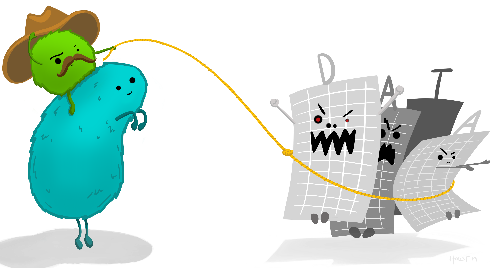
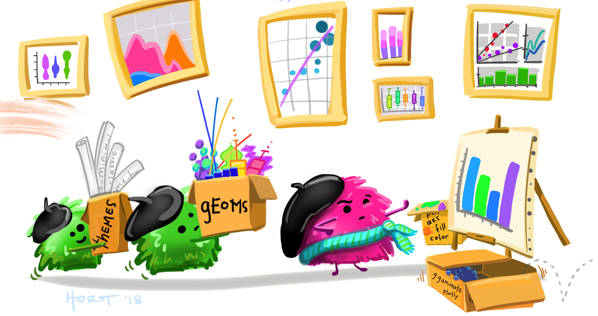
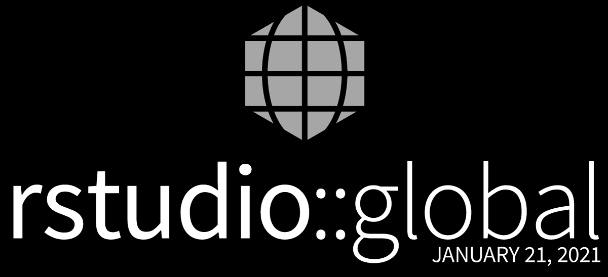

```{r xaringan-extras, echo=FALSE}
xaringanExtra::use_tile_view()
#xaringanExtra::use_share_again()
xaringanExtra::use_tachyons()
xaringanExtra::use_scribble(pen_color = "#035AA6")
xaringanExtra::use_extra_styles(
  hover_code_line = TRUE
)
```
```{r xaringan-themer, include=FALSE, warning=FALSE}
library(xaringanthemer)
style_duo_accent(
  primary_color = "#035AA6", secondary_color = "#03A696",
  link_color = "#03A696",
  header_font_google = google_font("Josefin Sans"),
  text_font_google   = google_font("Montserrat", "300", "300i"),
  code_font_google   = google_font("Fira Mono"),
  text_font_size = "1.25rem"
)
```

# What is R?

R is a statistical programming language.

--

<figure>
</img>
<figcaption, style = "font-size: .5rem; position:absolute; top: 92%; left: 65%">Source: <a href = "https://github.com/allisonhorst/stats-illustrations">Allison Horst</a></figcaption>
</figure>

---

# What is R?

R is a statistical programming language.

<figure>
</img>
<figcaption, style = "font-size: .5rem; position:absolute; top: 95%; left: 50%">Source: <a href = "https://github.com/allisonhorst/stats-illustrations">Allison Horst</a></figcaption>
</figure>

---

# What is R?


R is a statistical programming language.

It allows you to  flexibly

* wrangle

</img>


* analyze

* visualize your data.

<figure>
</img>
<figcaption, style = "font-size: .5rem; position:absolute; top: 95%; left: 63%">Source: <a href = "https://github.com/allisonhorst/stats-illustrations">Allison Horst</a></figcaption>
</figure>


---

# What is R?


It can even integrate into your documents and presentations to provide a reproducible way to communicate your findings to others.


<figure>
</img>
<figcaption, style = "font-size: .5rem; position:absolute; top: 95%; left: 45%">Source: <a href = "https://github.com/allisonhorst/stats-illustrations">Allison Horst</a></figcaption>
</figure>

---

# What is R?

It is built on the S programming language developed in Bell Labs that was updated to S+ and ported to the open source version called R.

---

# Conventions

* All `code` is in monospace font with grey box

* R functions end with parentheses: `function()`

* Directory names end with slash: `home/`

* Package names are surrounded by curly braces: .package[{tidyverse}]

* Keyboard buttons have a border and a plus: .keybutton[`Ctrl`]+.keybutton[`S`]

* These are parentheses `()`, brackets `[]`, and braces `{}`

* Links are in [green text](https://github.com/jstevens5/dsvr2021)

* When I want you to run code, I will put it on it's own line:
```{r eval = FALSE}
2+2
```

* User-specific code will be in `<>`: `my_name <- "<your name>"`

---
# Getting started

## Installing R
Download at https://r-project.org.

R is command-line-driven software that works in the **terminal**. Spin up terminal to start R.
* Windows: Press .keybutton[&#8862; `Win`] then type `cmd`.

* MacOS: Press .keybutton[`Cmd`]+.keybutton[`Space`] then type `terminal`.

* Linux: Press .keybutton[`Control`]+.keybutton[`T`].

Once the terminal opens, type `R`.

---

# Getting started

## Upgrading R
* Linux: use Linux package manager (installs over old version)

* Windows and MacOS: go back to  https://r-project.org and install new version (installs along side old version)

* For Windows, check out the [.package[{installr}]](https://talgalili.github.io/installr/) to help with installing and upgrading R and its packages

* For MacOS, check out [.package[{updateR}]](https://github.com/AndreaCirilloAC/updateR)

--

.bg-washed-red.b--dark-red.ba.bw2.br3.shadow-5.ph4.mt5[
**Warning:** By mentioning and/or recommending packages, I am not guaranteeing they they will work or are safe to use. Use at your own risk!]

---

# Packages


Base R is the core, default software needed to run R maintained by the R Development Team<sup>*</sup>.

.footnote[*Actually, there are also some packages installed when you install base R.]

--

But other people can contribute packages, or collections of data and functions.

--

The official repository for R packages is the Comprehensive R Archive Network or [CRAN](https://cloud.r-project.org/web/packages/index.html). There are more than 17,000 packages on CRAN!

--

Packages can also be stored at other locations such as [GitHub](https://github.com), especially during development.

---

# Packages

## Installing

In the console type `install.packages("<package_name>")` where `<package_name>` is the name of the package.

Try installing the [.package[{devtools}]](https://devtools.r-lib.org) package.
``` {r eval = FALSE, echo = TRUE}
install.packages("devtools")
```

You can install multiple packages simultaneously by wrapping them with `c()`. For example, 
``` {r eval = FALSE, echo = TRUE}
install.packages(c("remotes", "here"))
```


---

# Packages

## Updating

Installing packages copies them in their state at download onto your local computer. As bugs are fixed and functions are enhanced or removed, the packages change.

To update a package, type `update.package("<package_name>")`.


---

# Packages

## Loading and unloading

Installing packages just means that you have copies of them on your computer. You have to load them for R to have access to their functionality. To load packages, use the `library()` function.

Load the [.package[{here}]](https://here.r-lib.org/) package, which provides functions for using projects in R.

``` {r eval = FALSE}
library("here")
```
Every time to close your R session, you'll have to reload the packages you were using. If you want to unload a package, use `detach()`.

---

# Packages

## Using

Once you load a package, you have access to all of its functions for that R session. But if it is not loaded, you won't have access.

Try this:
``` {r eval = FALSE}
session_info()
```

--

You should receive an error that R .errorcode[`could not find the function "session_info"`].

---

# Packages

But you can either load the [.package[{devtools}]](https://devtools.r-lib.org) package, or use this trick to call a specific function from a specific package.
``` {r}
devtools::session_info()
```


---

# Getting help

## Help with functions

To get help with functions, use `?` and `??` to open function documentation in RStudio.

* `?` is for function in loaded packages

* `??` is for all installed functions (even if package is not loaded)

* CRAN is for non-installed packages

---

# Getting help

## Help documentation

Standard documentation includes

* Description---short description of function purpose

* Usage---complete list of function arguments and default values

* Arguments---description of each argument

* Details---more detailed description of functionality

* Value---description of output returned by function

* See Also---related functions

* Examples---example code of function usage


---

# Getting help

## Help documentation

Vignettes are short tutorials on specific topics within a function

* View vignettes for all *installed* packages with `vignette()`

* View vignettes for all *loaded* packages with `vignette(all = FALSE)`

* View vignettes for a particular package with `vignette(package = "package_name")`

* Run a vignette with `vignette("vignette_name", package = "package_name")`


---

# Getting help

## Help documentation

To see package information, type `?package_name`.

``` {r eval = FALSE}
?devtools
```

This includes an index of all of the functions in that package.


---

# Getting help

## Online forums

* [RStudio Community](https://community.rstudio.com)--RStudio-specific forum (e.g., tidyverse, devtools, shiny)

* [Stack Overflow](https://stackoverflow.com)--Coding-related questions (e.g., about non-tidyverse R functionality)

* [Cross Validated](https://stats.stackexchange.com/)--Statistics questions (not R-specific)

## Online portals/books

* [Tidyverse](https://www.tidyverse.org/)

* [RStudio books](https://rstudio.com/resources/books/)


---

# Getting help

## Last stop: GitHub

Much of the code for R packages is stored on GitHub. So the *Issues* part of a GitHub repo is a good place to find answers to your problems.

--

*Issues* is where you submit bug reports and feature requests.


---

# RStudio

R is just a statistics engine with a minimal interface. The best way to work with R is through RStudio, which is an Integrated Desktop Environment (IDE) for R. It includes:
* R console

* operating system terminal

* text editor

* file manager

* plot display

* package manager

* documentation

* version control


---

# tidyverse

## Core tidyverse packages
*  .package[{ggplot2}], for data visualisation

*  .package[{dplyr}], for data manipulation

*  .package[{tidyr}], for data tidying

*  .package[{readr}], for data import

*  .package[{purrr}], for functional programming

*  .package[{tibble}], for tibbles, a modern re-imagining of data frames

*  .package[{stringr}], for strings

*  .package[{forcats}], for factors


---

# tidyverse

## Principles of tidy tools

1. Reuse existing data structures.

1.  Compose simple functions with the pipe.

1.  Embrace functional programming.

1.  Design for humans.


---
background-image: url("images/hadley_wickham.jpg")
background-size: 600px
background-position: 65% 8%

# tidyverse

## Meet Hadley Wickham!


---

# RStudio values

.pull-left[
* RStudio is a [Certified B Corporation](https://bcorporation.net/directory/rstudio) 
]

.pull-right[
[](https://rstudio.com)
]


---

# RStudio values

.pull-left[
* RStudio is a [Certified B Corporation](https://bcorporation.net/directory/rstudio) 

* RStudio develops open-source software
]

.pull-right[

]


---

# RStudio  values

.pull-left[
* RStudio is a [Certified B Corporation](https://bcorporation.net/directory/rstudio) 

* RStudio develops open-source software

* RStudio emphasizes reproducible data science
]

.pull-right[
[](https://rmarkdown.rstudio.com/)
]


---

# RStudio values

.pull-left[
* RStudio is a [Certified B Corporation](https://bcorporation.net/directory/rstudio) 

* RStudio develops open-source software

* RStudio emphasizes reproducible data science

* RStudio makes a commitment to the community

  - education
]

.pull-right[
[](https://community.rstudio.com/)
]


---

# RStudio values

.pull-left[
* RStudio is a [Certified B Corporation](https://bcorporation.net/directory/rstudio) 

* RStudio develops open-source software

* RStudio emphasizes reproducible data science

* RStudio makes a commitment to the community

  - education
  
  - conferences
]

.pull-right[
[](https://rstudio.com/resources/rstudioglobal-2021/)
]


---

# RStudio values

.pull-left[
* RStudio is a [Certified B Corporation](https://bcorporation.net/directory/rstudio) 

* RStudio develops open-source software

* RStudio emphasizes reproducible data science

* RStudio makes a commitment to the community

  - education
  
  - conferences
  
  - inclusion
]
<figure>
</img>
<figcaption, style = "font-size: .5rem; position:absolute; top: 92%; left: 72%">Source: <a href = "https://github.com/allisonhorst/stats-illustrations">Allison Horst</a></figcaption>
</figure>


---

# Homework

### Before the first class period

* Install R from https://r-project.org

* Install RStudio from https://rstudio.com

* Create an account at RStudio Cloud: https://rstudio.cloud

* Create an account at GitHub: https://github.com

* Complete course introduction form

* Read the syllabus

* Read readings in syllabus schedule

<figure>
</img>
<figcaption, style = "font-size: .5rem; position:absolute; top: 82%; left: 77%">Source: <a href = "https://github.com/allisonhorst/stats-illustrations">Allison Horst</a></figcaption>
</figure>

