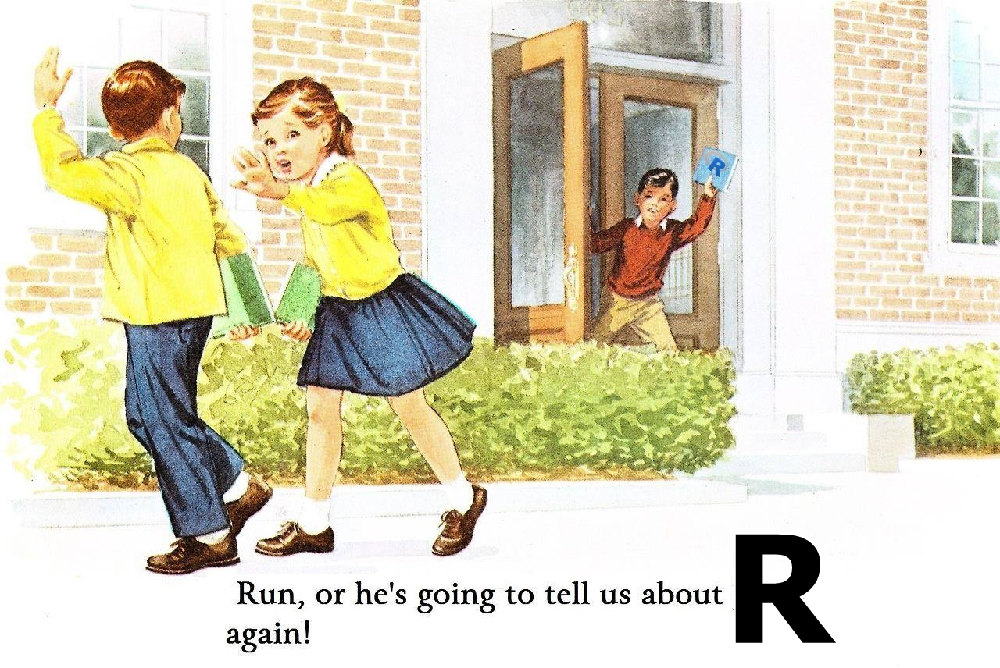
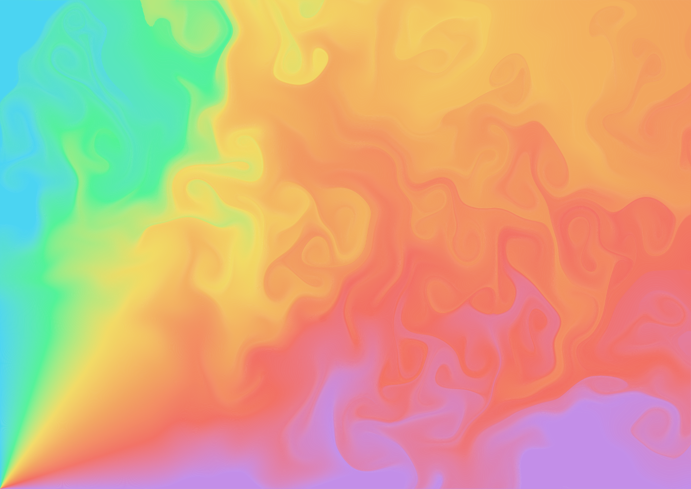
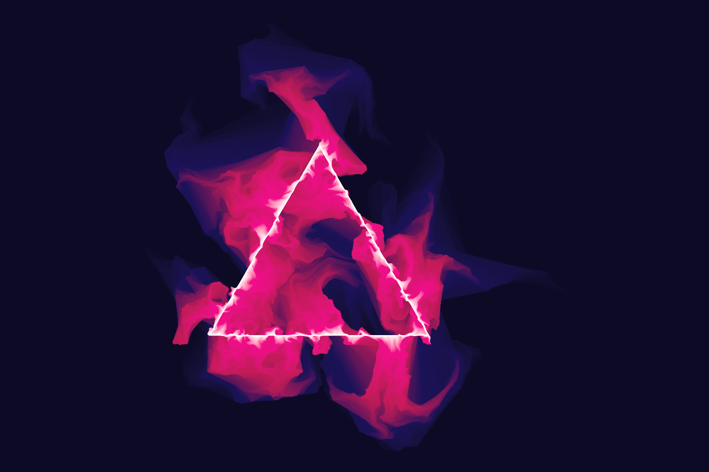
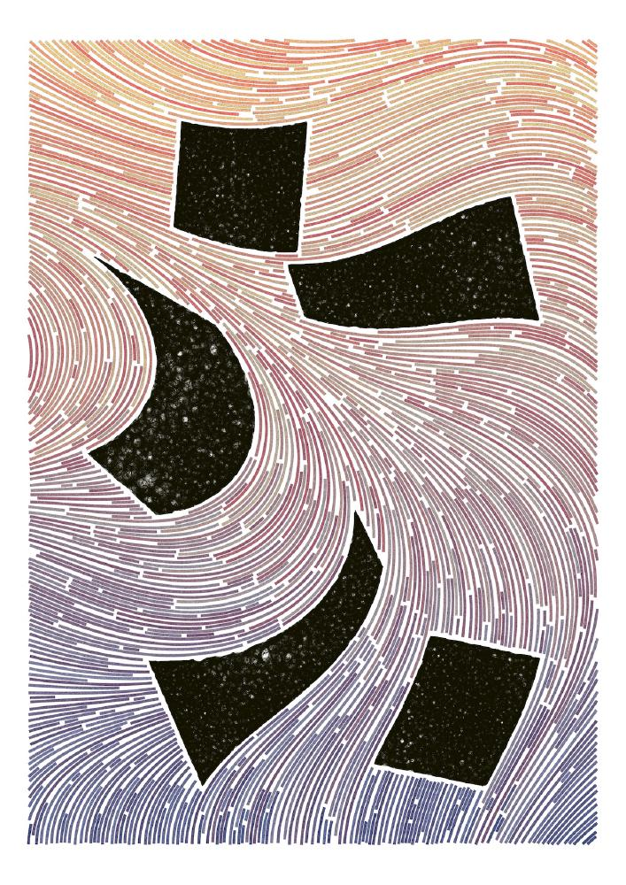
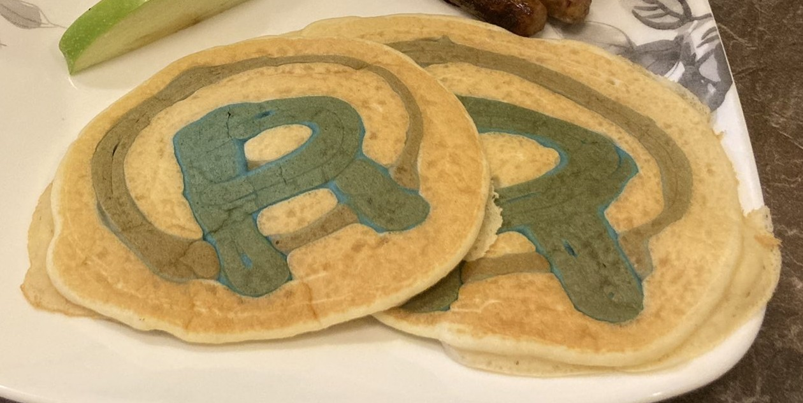
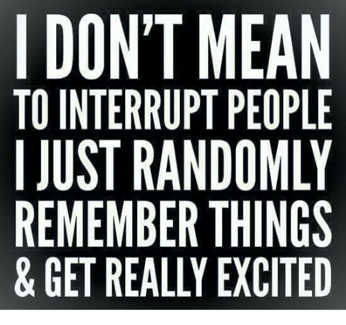

```{r xaringan-extras, echo=FALSE}
xaringanExtra::use_tile_view()
# xaringanExtra::use_share_again()
xaringanExtra::use_tachyons()
xaringanExtra::use_scribble(pen_color = "#035AA6")
xaringanExtra::use_extra_styles(
  hover_code_line = TRUE
)
```
```{r xaringan-themer, include=FALSE, warning=FALSE}
library(xaringanthemer)
style_duo_accent(
  primary_color = "#035AA6", secondary_color = "#03A696",
  link_color = "#03A696",
  header_font_google = google_font("Josefin Sans"),
  text_font_google   = google_font("Montserrat", "300", "300i"),
  code_font_google   = google_font("Fira Mono"),
  text_font_size = "1.35rem"
)
```


# Data science

.bg-washed-green.b--dark-green.ba.bw2.br3.shadow-5.ph4.mt5[
the process of formulating a quantitative question that can be answered with data, collecting and cleaning the data, analyzing the data, and communicating the answer to the question to a relevant audience

.right[
— Jeff Leek, [Advanced Data Science](http://jtleek.com/ads2020/)
]
]

--

1. Define the question of interest
2. Get the data
3. Clean the data
4. Explore the data
5. Fit statistical models
6. Communicate the results
7. Make your analysis reproducible


---
background-image: url("../images/code_hero_allisonhorst.jpg")
background-size: contain

# Course goal

<figcaption, style = "font-size: .5rem; position:absolute; top: 97%; left: 45%">Source: <a href = "https://github.com/allisonhorst/stats-illustrations">Allison Horst</a></figcaption>


---

# Course information

* Course structure


--

* Assignments


--

</img>

</img>
</img>

<a href="https://www.data-imaginist.com/art"></img></a>
<a href="https://www.data-imaginist.com/art"></img></a>
<a href="https://www.data-imaginist.com/art"></img></a>

</img>


---

# Course information

* Course structure

* Assignments

* Diversity, inclusion, wellness


---

# Course information

* Course structure

* Assignments

* Diversity, inclusion, wellness

* Course materials
    - https://github.com/JeffreyRStevens/dsvr2021/


---

# Conventions

* All `code` is in monospace font with grey box

* R functions end with parentheses: `function()`

* Directory names end with slash: `home/`

* Package names are surrounded by curly braces: .package[{tidyverse}]

* Keyboard buttons have a border and  a plus: .keybutton[`Ctrl`]+.keybutton[`S`]

* These are parentheses `()`, brackets `[]`, and braces `{}`

* Links are in [green text](https://github.com/jstevens5/dsvr2021)

* Many images are linked to source or documentation

---

# Review

## What is R? (history, installing, upgrading)

## Packages (CRAN, installing, updating, loading)

## Getting help in the console (`?` and `??`)

## RStudio and tidyverse principles

---

# Tour of RStudio Desktop

</img>

---

# Keyboard shortcuts

Here are some of my favorite things!

| Function | Keyboard shortcut |
| -------- | ----------------- |
| Run current line/chunk of code | .keybutton[`Ctrl/Cmd`]+.keybutton[`Enter/Return`]|
| Source entire script | .keybutton[`Ctrl/Cmd`]+.keybutton[`Shift`]+.keybutton[`S`]|
| Run from document beginning to current line | .keybutton[`Ctrl/Cmd`]+.keybutton[`Alt/Opt`]+.keybutton[`B`]|
| Insert assignment operator `<-` | .keybutton[`Alt/Opt`]+.keybutton[`-`] |
| Insert tidyverse pipe `%>%` | .keybutton[`Ctrl/Cmd`]+.keybutton[`Shift`]+.keybutton[`M`]|
| Insert code section | .keybutton[`Ctrl/Cmd`]+.keybutton[`Shift`]+.keybutton[`R`]|
| Restart R session | .keybutton[`Ctrl/Cmd`]+.keybutton[`Shift`]+.keybutton[`F10`]|

---

# Installing packages


[](https://reprex.tidyverse.org/)

---

# Getting help

[Cheatsheets](https://rstudio.com/resources/cheatsheets/)

---

# Search


---

# Tips

* Learn to use keyboard shortcuts

* You can remap keyboard shortcuts (I've remapped *Insert assignment operator* to .keybutton[`Ctrl/Cmd`]+.keybutton[`Shift`]+.keybutton[`,`])

* Restart R often


---

# Homework

### Wrap-up this lesson

* Complete the exercises on shinyapps.io

--

### For next class meeting

* Troubleshoot any installation or login issues (contact me if needed)

* Install course R packages

* Read [R4DS](https://r4ds.had.co.nz/) Chs. 1, 4, 6, 8

* View Coding in R presentation

</img>
<figcaption, style = "font-size: .5rem; position:absolute; top: 95%; left: 73%">Source: <a href = "https://github.com/allisonhorst/stats-illustrations">Allison Horst</a></figcaption>

