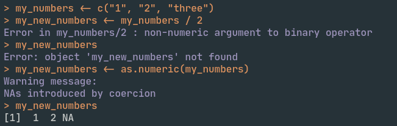

```{r xaringan-extras, echo=FALSE}
xaringanExtra::use_tile_view()
# xaringanExtra::use_share_again()
xaringanExtra::use_tachyons()
xaringanExtra::use_scribble(pen_color = "#035AA6")
xaringanExtra::use_extra_styles(
  hover_code_line = TRUE
)
```
```{r xaringan-themer, include=FALSE, warning=FALSE}
library(xaringanthemer)
style_duo_accent(
  primary_color = "#035AA6", secondary_color = "#03A696",
  link_color = "#03A696",
  header_font_google = google_font("Josefin Sans"),
  text_font_google   = google_font("Montserrat", "300", "300i"),
  code_font_google   = google_font("Fira Mono"),
  text_font_size = "1.35rem"
)
```

# Outline

## Terminology
## Running commands
## Assigning values
## Coding style
## Naming things


---
background-image: url("../images/coding_wordcloud.png")
background-size: contain


---

# Terminology

## R session

</img>


---

# Terminology

## Functions

#### Take input, process it, and create output

```{r eval = FALSE}
read_csv("mypath/myfile.csv")
```

```{r eval = FALSE}
filter(mydata, mycolumn == "Sophomore")
```

```{r eval = FALSE}
plot(x, y)
```

```{r eval = FALSE}
write_csv(mydata, "mypath/myfile.csv")
```


---

# Terminology

## Arguments

#### Specifications for information needed by functions

```{r eval = FALSE}
read_csv(file = "mypath/myfile.csv")
```

```{r eval = FALSE}
filter(.data = mydata, mycolumn == "Sophomore")
```

```{r eval = FALSE}
plot(x = x, y = y)
```

```{r eval = FALSE}
write_csv(x = mydata, file = "mypath/myfile.csv")
```


---

# Terminology

## Objects

#### Variables created to store information

```{r eval = FALSE}
mydata <- read_csv(file = "mypath/myfile.csv")
```

```{r eval = FALSE}
trimmed_data <- filter(.data = mydata, mycolumn == "Sophomore")
```

```{r eval = FALSE}
myplot <- plot(x = x, y = y)
```


---

# Running commands

## Console

</img>


---

# Running commands

## Console

### Error: stops a function from completing

</img>

---

# Running commands

## Console

### Warning: does not stop a function from completing

</img>

---

# Running commands

## Scripts

</img>


---

# Running commands

## Scripts

### Line-by-line or selected chunks

.keybutton[`Ctrl/Cmd`]+.keybutton[`Enter`]


--

### All code above cursor

.keybutton[`Ctrl/Cmd`]+.keybutton[`Alt/Opt`]+.keybutton[`B`]


---

# Running commands

## Scripts

### Sourcing

.keybutton[`Ctrl/Cmd`]+.keybutton[`Shift`]+.keybutton[`S`]


---

# Running commands

## Comments

#### Comments are not executed by R

```{r eval = FALSE}
2+2 # this is a comment--I can say stuff that isn't run. use me often!
# this is also a comment--I can be on my own line!
```


---

# Running commands

## Comments

#### Comments can be used to create sections in your scripts in RStudio

.keybutton[`Ctrl/Cmd`]+.keybutton[`Shift`]+.keybutton[`R`]

```{r}
# This is a section ------

## This is a subsection ------

### This is a subsubsection ------
```

---

# Assignment

## Assignment operators

#### Assign a value or set of values to an object

```{r}
# the best way
x <- 9

# avoid this
y = 10

# definitely don't do this
11 -> z
```

---

# Assignment

## Multiple assignment

### Simultaneous

```{r}
# chain assignments of the same value to different objects
a <- b <- c <- 0
```

--

### Sequential
```{r}
# while you can do this
a <- 1; b <- 2; c <- 3

# do this instead
a <- 1
b <- 2
c <- 3
```

---

# Coding style


---
background-image: url("../images/drake_meme.jpg")
background-size: 62%
background-position: 71% 75%

# Coding style

## Spacing

.drake-upper[
```{r eval = FALSE}
mean(x[1,4:10],na.rm=TRUE)+0.5
```
]
.drake-lower[
```{r eval = FALSE}
mean(x[1, 4:10], na.rm = TRUE) + 0.5
```
]


---
background-image: url("../images/drake_meme.jpg")
background-size: 62%
background-position: 71% 75%

# Coding style

## Clarity

.drake-upper[
```{r eval = FALSE}
mean(x, na.rm = T)
```
]
.drake-lower[
```{r eval = FALSE}
mean(x, na.rm = TRUE)
```
]


---
background-image: url("../images/drake_meme.jpg")
background-size: 62%
background-position: 71% 75%

# Coding style

## Indenting

.drake-upper[
```{r eval = FALSE}
for(i in 1:10) {
for(j in 1:5) {
print(x[i, j])
}
}
```
]
.drake-lower[
```{r eval = FALSE}
for(i in 1:10) {
  for(j in 1:5) {
    print(x[i, j])
  }
}
```
]


---
background-image: url("../images/drake_meme.jpg")
background-size: 62%
background-position: 71% 75%

# Coding style

## Line breaks

.drake-upper[
```{r eval = FALSE}
if (x > 5) {print("Too big!")}
```
]
.drake-lower[
```{r eval = FALSE}
if (x > 5) {
  print("Too big!")
}
```
]


---

# Coding style

[The tidyverse style guide](https://style.tidyverse.org/)

* Use `<-` as assignment operator

* Use space between most operators (`*`, `=`, `==`) and after all commas

* Write out `TRUE` and `FALSE`

* Do not use space between function and parentheses (except for `if ()`)

* Use indents to separate nested components

* Use `"`, not `'`, for quoting text unless it already contains double quotes

* Start new line after `%>%`

---

# Coding style

## Package help

[.package[{lintr}]](https://github.com/jimhester/lintr)


[.package[{styler}]](https://styler.r-lib.org/)

---

# Naming things

## Core principles

* Be nice to machines

* Be nice to humans

* Make sorting and searching easy

.footnote[Sources: [Naming things: Jenny Bryan](https://speakerdeck.com/jennybc/how-to-name-files), [Project structure: Danille Navarro](https://slides.djnavarro.net/project-structure)]

---

# Naming objects

.pull-left[
* be descriptive (not `x`) but not too descriptive (`this_is_my_object`)

* separate words (preferably using snake_case)

* avoid capital letters (case matters: `abc != ABC`)

* don't use existing functions (e.g., `mean`)

* can't start with a number

]

</img>
<figcaption, style = "font-size: 0.5rem; position:absolute; top: 95%; left: 70%">Source: <a href = "https://github.com/allisonhorst/stats-illustrations">Allison Horst</a></figcaption>


---

# Naming data columns

* same principles as naming objects

* to clean unwieldy column names, try `clean_names()` from [.package[{janitor}]](https://github.com/sfirke/janitor)

---

# Naming files and folders

## Be nice to machines

* avoid spaces, special characters, and accented characters

  * `my_file.R` not `My filé$.R`
  
--

* avoid case sensitivity
  * `foo.R` and `Foo.R`

--

* use consistent, searchable text chunks
  * `expt1_cond2_subj114.csv`

--

* use snake_case or other delimiters 

---

# Naming files and folders

## Be nice to humans

* use human readable names that contain **content** (slugs)

  * `prelim_analysis_expt1.R`

---

# Naming files and folders

## Make sorting and searching easy

* use ISO 8601 standard for date `YYYY-MM-DD`

--

* no, really---always use ISO 8601 standard for date `YYYY-MM-DD`

--

* use ISO 8601 dates before **slugs**
  * `2021-04-06_prelim-analysis-expt1.Rmd`

--

* use padded numbers as prefixes
  * `01_preface.Rmd`
  * `02_introduction.Rmd`
  * `03_methods.Rmd`

---

# Homework

### For next class meeting

* Read [R4DS](https://r4ds.had.co.nz/) Chs. 1, 4, 6, 8

* Bring questions to class

