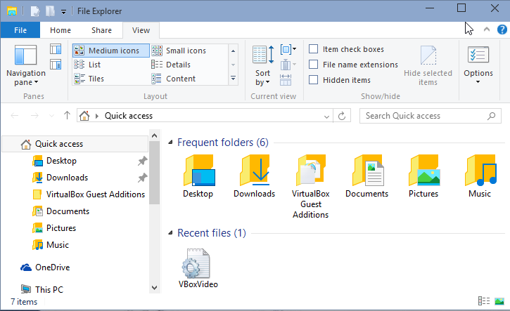
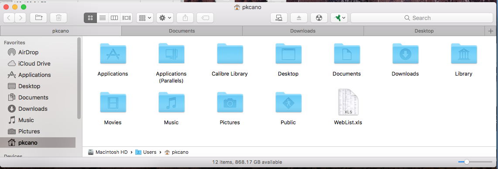
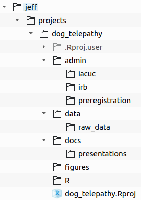
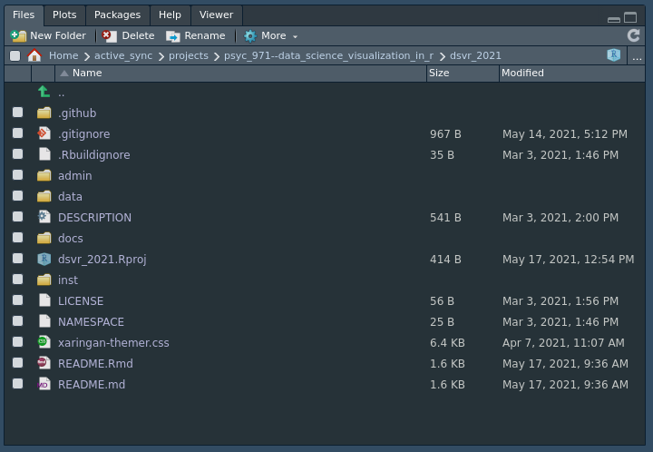
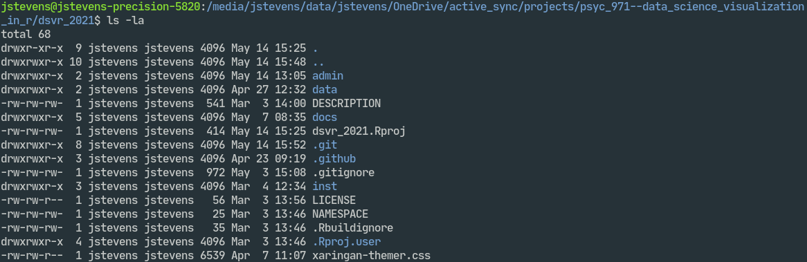
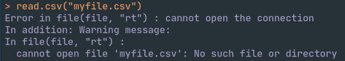
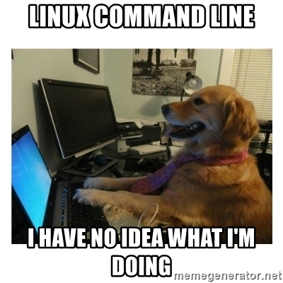
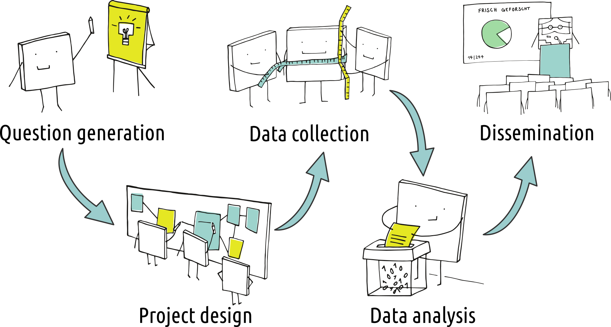
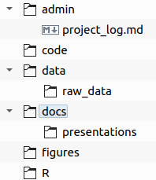

```{r xaringan-extras, echo=FALSE}
xaringanExtra::use_tile_view()
# xaringanExtra::use_share_again()
xaringanExtra::use_tachyons()
xaringanExtra::use_scribble(pen_color = "#035AA6")
xaringanExtra::use_extra_styles(
  hover_code_line = TRUE
)
```
```{r xaringan-themer, include=FALSE, warning=FALSE}
library(here)
library(xaringanthemer)
style_duo_accent(
  primary_color = "#035AA6", secondary_color = "#03A696",
  link_color = "#03A696",
  header_font_google = google_font("Josefin Sans"),
  text_font_google   = google_font("Montserrat", "300", "300i"),
  code_font_google   = google_font("Fira Mono"),
  text_font_size = "1.35rem"
)
```

# Review

### Terminology (functions, arguments, objects)

### Executing commands (console, scripts, comments)

### Assignment (<-, assignment chaining)

### Coding style (spacing, indenting)

### Naming things (objects, columns, files, folders)


---

# Directories/folders

## File system

#### Structure of directories and files stored on your computer

```{r echo = FALSE}
fs::dir_tree(path = "~/OneDrive/active_sync/teach/psyc_971--data_science_visualization_in_r/dsvr_2021")
```


---

# Directories/folders

## File managers

* OS
  * Windows File Explorer (N = 25)
  * MacOS Finder (N = 21)
  * Linux Nautilus, Dolphin, Nemo (N = 3)

</img>
</img>
</img>

---

# Directories/folders

## File managers

* RStudio

</img>

---

# Directories/folders

## Terminals

</img>

--

* If not familiar with terminal, read primer for [Windows](https://www.computerhope.com/issues/chusedos.htm) or [MacOS](https://developer.apple.com/library/archive/documentation/OpenSource/Conceptual/ShellScripting/CommandLInePrimer/CommandLine.html)
  

---

# Directories/folders

## Paths

#### Convert hierarchical/tree structure to character string

</img>

--

* Absolute path (starts with drive letter or `/`)

  * Windows: `C:\users\jeff\Documents\projects\dog_telepathy\R`
  
  * Linux and MacOS: `/home/jeff/projects/dog_telepathy/R/`

--

* Relative path (starts with first subdirectory name)

  * If in `projects/`, relative path to `R/` is `dog_telepathy/R`
  
  * Can go backwards (up the tree) with `..`

---

# Directories/folders


## Change directories from command line with `cd`

* `/home/jeff/projects/dog_telepathy/R/`

* To move from `projects/` to `R/`, type `cd dog_telepathy/R`

</img>

--

## Move backwards with `cd ..`

* To move from `R/` to `raw_data/`, type `cd ../data/raw_data`

* To move from `raw_data/` to `jeff/`, type `cd ../../../..`

---

# Directories/folders

## Hidden files and directories

Start with `.` (e.g., `.gitignore`)

Toggle view of hidden files with

* Windows and Linux: .keybutton[`Ctrl`]+.keybutton[`H`]
    
* MacOS: .keybutton[`Cmd`]+.keybutton[`Shift`]+.keybutton[`.`]

---

# Directories/folders

## Working directories

#### Base directory for R session

--

### Viewing your working directory

* Console: `getwd()`
* RStudio: top of Console

--

### Setting your working directory

* Console: `setwd()`
* RStudio: *Session → Set Working Directory*

---

# Directories/folders

## Working directories

#### If you have problems importing or saving files, it is probably because of your working directory

</img>

---

# Questions about terminals or directories?

</img>
---

# Workflows

> a workflow describes what a researcher does to make advances on scientific questions: developing hypotheses, wrangling data, writing code, and interpreting results
> 
> — [Stoudt et al. (2021) PLOS Computational Biology](https://doi.org/10.1371/journal.pcbi.1008770)

--

</img>

---

# Workflows

## Project directory structure

</img>

--

.pull-left[
* Adapt structure to your needs or lab requirements

* Make a template directory

]

---

# Workflows

## R Projects

#### Convenient system to:

* Set working directory

* Open files you had open before closing RStudio

* Focus on relative paths

* Enable version control (next class meeting)

#### Use them! Always!


---

# Workflows

.pull-left[
[.package[{here}]](https://here.r-lib.org/): The package that sets your working directory to the R Project root directory

* `read_csv(here("data/a.csv"))`

]
</img>

<figcaption, style = "font-size: 0.5rem; position:absolute; top: 95%; left: 70%">Source: <a href = "https://github.com/allisonhorst/stats-illustrations">Allison Horst</a></figcaption>


---

# Summary

### Directory structures

### Paths (relative, absolute)

### Changing directories

### Workflows

### R Projects

---

# Homework

.pull-left[
### Wrap-up this lesson

* Complete exercises

* If not familiar with terminal, read primer for [Windows](https://www.computerhope.com/issues/chusedos.htm) or [MacOS](https://developer.apple.com/library/archive/documentation/OpenSource/Conceptual/ShellScripting/CommandLInePrimer/CommandLine.html)
]

.pull-right[
### For next class meeting

* Read [Bryan 2017](https://doi.org/10.7287/peerj.preprints.3159v2)

* Install Git
  - Windows: https://git-scm.com/download/win
  - Mac: https://git-scm.com/download/mac

* Install [GitHub Desktop](https://desktop.github.com/)

* View Version Control presentation
]
