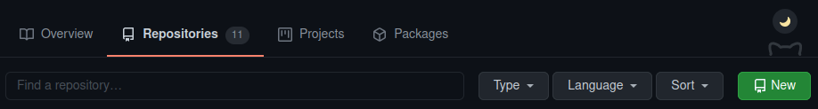

```{r xaringan-extras, echo=FALSE}
xaringanExtra::use_tile_view()
# xaringanExtra::use_share_again()
xaringanExtra::use_tachyons()
xaringanExtra::use_scribble(pen_color = "#035AA6")
xaringanExtra::use_extra_styles(
  hover_code_line = TRUE
)
```
```{r xaringan-themer, include=FALSE, warning=FALSE}
library(xaringanthemer)
style_duo_accent(
  primary_color = "#035AA6", secondary_color = "#03A696",
  link_color = "#03A696",
  header_font_google = google_font("Josefin Sans"),
  text_font_google   = google_font("Montserrat", "300", "300i"),
  code_font_google   = google_font("Fira Mono"),
  text_font_size = "1.35rem"
)
```

# Version control

</img>

---

# What is Git?

1. Version control

1. Collaboration

1. Dissemination

</img>

---

# What Git does

1. Git creates repositories for projects

1. Git is built for plain text files

1. Git stores differences (diffs) between versions of files

1. Git let's you revert to previous versions

1. Git let's you build alternative branches that maintain your main branch


---

# What about GitHub?

1. GitHub is a website allowing storage of public and private repositories

1. GitHub is one of several repo hosting services (but the most popular)

1. GitHub allows you to share your repos with others (controlling different levels of access)

1. GitHub allows you to create 'organizations'

1. You can create your own website on GitHub for free

</img>
</img>

---

# Git and GitHub

.pull-left[
* Git is on your computer and tracks changes only on that local version. 

* GitHub is in the cloud and acts as a backup, collaboration tool, and dissemination platform.

* Unlike Box and OneDrive, Git and GitHub do not automatically sync file changes. You must `push` and `pull`.
]

</img>

<figcaption, style = "font-size: 0.5rem; position:absolute; top: 97%; left: 70%">Source: <a href = "https://www.freepik.com/free-vector/static-asset-illustration-concept_6195521.htm">stories at freepik.com</a></figcaption>

---

# Git overview

</img>

---

# Gitting started

## Open terminal

* Windows: Press .keybutton[&#8862; `Win`] then type `cmd`.

* MacOS: Press .keybutton[`Cmd`]+.keybutton[`Space`] then type `terminal`.

--

## Configure Git

* Add name and email
```{}
git config --global user.name '<Your name>'
git config --global user.email '<Your email>'
```

---

# Gitting started

## Change to where you want this directory

```{}
cd Documents/testing/
```


---

# Gitting started

## Create Git repo

* Create new directory `git_test/` 
```{}
mkdir git_test
```

--

* Change to that directory 
```{}
cd git_test
```

--

* Initialize Git repo
```{}
git init
```

---

# Ignoring files

Add files, file types, and directories to `.gitignore` to prevent Git from tracking them

* R gitignore template: https://www.toptal.com/developers/gitignore/api/r

</img>


---

### 

# Checking in

`git status`

* Which branch

* Checks whether local repo is up-to-date with _remote_

* Staged files ready for commit

* Untracked files


---

# Staging files

`git add`

* To stage all changed and untracked files, use `git add .`

* To stage a specific files or subdirectory, use 

  - `git add filename`
  
  - `git add file1 file2 subdirectory/myfile*`
  
  - `git add directory/`

* To unstage all staged files, use `git reset` (this will **NOT** delete your files)


---

# Commit files

`git commit -m "Commit message"`

* Takes snapshot

--

* Must include commit message

</img>

<figcaption, style = "font-size: 0.5rem; position:absolute; top: 95%; left: 70%">Source: <a href = "https://xkcd.com/1296/">xkcd</a></figcaption>


---

# Commit messages

[Writing good commit messages](https://chris.beams.io/posts/git-commit/)
  - Subject should describe change in as few words as possible (<50 characters)

  - Start subject with an imperative verb ("This commit will...")
      - `Add .gitignore file`
      
      - `Fix typo in abstract`
      
  - Captialize first word but don't end with period
  
  - Give more details in body


---

# Working with remotes

</img>

<figcaption, style = "font-size: 0.5rem; position:absolute; top: 97%; left: 45%">Source: <a href = "https://www.freepik.com/free-vector/static-asset-illustration-concept_6195521.htm">stories at freepik.com</a></figcaption>


---

# Working with remotes

## Setting up remotes

#### Create remote repo

</img>


---

# Working with remotes

## Setting up remotes

`git remote add origin <remote URL>`

--

## Viewing remotes

`git remote -v`

--
## Changing remotes

`git remote set-url origin <new remote URL>`


---

# Working with remotes

</img>


--

.pull-right[
`git pull`

* Updates local repo from remote repo

* Always pull before working on shared repo!
]


---

# Working with remotes

</img>

--

.pull-right[
`git push -u origin main`

`git push`

* Updates remote repo from local repo

* Always push when finished committing on shared repo!
]


---

# Working with remotes

## Cloning existing repositories

`git clone <remote URL>`

--

#### Clone the course repo

First, change to the directory where you want this repo to live (using `cd`). Currently, repo is about 300 MB. Then,

```{}
git clone https://github.com/dsvr2021/dsvr_2021.git
```

---

# Branches

### Different versions of same repo

</img>

---

# Branches

### Different versions of same repo

### Merge branches

</img>

---

# Branches

### Different versions of same repo

### Merge branches

### Default branch is called `master`, which you can change to `main`


---

# Git errros

* Merge conflicts

* Force pull from remote
  - `git fetch --all`
  - `git reset --hard origin/main`

* Deleting local `.git` directory

* Re-cloning

* [Oh Shit, Git!?!](https://ohshitgit.com/)

</img>

<figcaption, style = "font-size: 0.5rem; position:absolute; top: 96%; left: 68%">Source: <a href = "https://xkcd.com/1597/">xkcd</a></figcaption>

---

# Resources

* [Happy Git and GitHub for the useR](https://happygitwithr.com/)

* [Dr. Bourke's tutorial](http://cse.unl.edu/~cbourke/gitTutorial.pdf)

* [Git Guide](https://rogerdudler.github.io/git-guide/)

* [Software Carpentry's Version Control with Git](https://swcarpentry.github.io/git-novice/)

* [Pro Git](https://git-scm.com/book/en/v2)

* [git/github guide](https://kbroman.org/github_tutorial/)

* [Git cheatsheet](https://jan-krueger.net/wordpress/wp-content/uploads/2007/09/git-cheat-sheet.pdf)


---

# Homework

### For next class meeting

* Read [Bryan 2017](https://doi.org/10.7287/peerj.preprints.3159v2)

* Configure Git with username and email address
  
* Create and store GitHub Personal Access Token 
  - read [Cache credentials for HTTPS](https://happygitwithr.com/credential-caching.html)

* Create `testing/` directory somewhere safe (probably not in a synced folder)

* Clone [course repo](https://github.com/dsvr2021/dsvr_2021.git)
