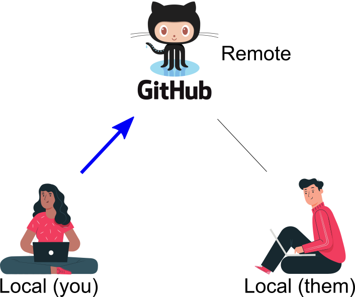

```{r xaringan-extras, echo=FALSE}
xaringanExtra::use_tile_view()
# xaringanExtra::use_share_again()
xaringanExtra::use_tachyons()
xaringanExtra::use_scribble(pen_color = "#035AA6")
xaringanExtra::use_extra_styles(
  hover_code_line = TRUE
)
```
```{r xaringan-themer, include=FALSE, warning=FALSE}
library(xaringanthemer)
style_duo_accent(
  primary_color = "#035AA6", secondary_color = "#03A696",
  link_color = "#03A696",
  header_font_google = google_font("Josefin Sans"),
  text_font_google   = google_font("Montserrat", "300", "300i"),
  code_font_google   = google_font("Fira Mono"),
  text_font_size = "1.35rem"
)
```

# Notes

* Can upgrade to RStudio preview version

* Run exercises through RStudio instead of shinyapps.io

* Pull course repo before class meetings

---

# Review

### Directory structures and paths (relative, absolute)

### Workflows and R Projects

___

--

### Command line Git commands
* Check `status`
* Then `add` to stage
* Then `commit` to repo
* And `push` to remote

---

# Today

### Create Git repo

### Connect to GitHub

### Clone repos

### Git GUIs

### Git in RStudio

---

# Version control

</img>

---

# Gitting started

## Create Git repo in `testing/` directory

* Create new directory `git_test/` 
  - `mkdir git_test`

* Change to that directory 
  - `cd git_test/`

* Initialize Git repo
  - `git init`

* Create R Project

---

# Gitting started

## Create another Git repo in `testing/` directory

* Create new directory `git_test2/` (**Don't nest git repos!**)
  - `mkdir git_test2`

* Change to that directory 
  - `cd git_test2/`

* Create R Project

* Initialize Git repo
  - `git init`


---

### 

# Tracking changes

### Checking in

`git status`

### Staging files

`git add`

### Commit files

`git commit -m "Commit message"`


---

# Commit messages

[Writing good commit messages](https://chris.beams.io/posts/git-commit/)
  - Subject should describe change in as few words as possible (<50)

  - Start subject with an imperative verb ("This commit will...")
      - `Add .gitignore file`

---

# Working with remotes

</img>

<figcaption, style = "font-size: 0.5rem; position:absolute; top: 97%; left: 45%">Programmer figures from <a href = "https://www.freepik.com/free-vector/static-asset-illustration-concept_6195521.htm">stories at freepik.com</a></figcaption>


---

# Working with remotes

## Setting up remotes

#### Create remote repo

</img>


---

# Working with remotes

## Setting up remotes

`git remote add origin https://github.com/dsvr2021/git_test.git`


---


# Working with remotes

</img>

--

.pull-right[
`git push -u origin main`

`git push`

* Updates remote repo from local repo

* Always push when finished committing on shared repo!
]


---

# Working with remotes

## Editing in GitHub


---

# Working with remotes

</img>


--

.pull-right[
`git pull`

* Updates local repo from remote repo

* Always pull before working on shared repo!
]


---

# Cloning existing repositories

#### Change to directory where you want this

* If you haven't already:

    - `git clone https://github.com/dsvr2021/dsvr_2021.git`

--

* If you have, change to directory and 

    - `git pull`
    
    - **Do this every time you want to look at/work in this repo!**

---

# Cloning existing repositories

#### Change to directory where you want this

* Clone new directory

    - `git clone https://github.com/dsvr2021/git_sandbox.git`

* Homework is to read this `README` file and complete the steps

---

# Git questions?

---

# Git GUIs

* [GitHub Desktop](https://desktop.github.com/)

* [GitKraken](https://www.gitkraken.com)

* [Git Tower](https://www.git-tower.com)

* [Others](https://git-scm.com/downloads/guis)

</img>


---

# Git integration in RStudio

</img>


---

# GitHub personal access tokens

--

## Set up personal access token (PAT)

* Go to GitHub Settings -> Developer settings -> Personal access tokens

* Generate new token

* Save this token somewhere safe (e.g., password manager)

* Install [.package[{gitcreds}]](https://r-lib.github.io/gitcreds/)

* Use `gitcreds::gitcreds_set()`

* See [Happy Git](https://happygitwithr.com/credential-caching.html) for more details

---

# Review

### Create Git repo

### Connect to GitHub

### Clone repos

### Git GUIs

### Git in RStudio

---

# Resources

* [Happy Git and GitHub for the useR](https://happygitwithr.com/)

* [Dr. Bourke's tutorial](http://cse.unl.edu/~cbourke/gitTutorial.pdf)

* [Git Guide](https://rogerdudler.github.io/git-guide/)

* [Software Carpentry's Version Control with Git](https://swcarpentry.github.io/git-novice/)

* [Pro Git](https://git-scm.com/book/en/v2)

* [git/github guide](https://kbroman.org/github_tutorial/)

* [Git cheatsheet](https://jan-krueger.net/wordpress/wp-content/uploads/2007/09/git-cheat-sheet.pdf)


---

# Homework

### Wrap-up this lesson

* Clone and complete steps in `git_sandbox` README

### For next class meeting

* Install [.package[{tinytex}]](https://yihui.org/tinytex/)

* Install [.package[{papaja}]](https://github.com/crsh/papaja) from GitHub with `devtools::install_github("crsh/papaja")`

* Read [R4DS Ch. 27](https://r4ds.had.co.nz/r-markdown.html), [Markdown tutorial](https://commonmark.org/help/tutorial/)

* View literate programming presentation
