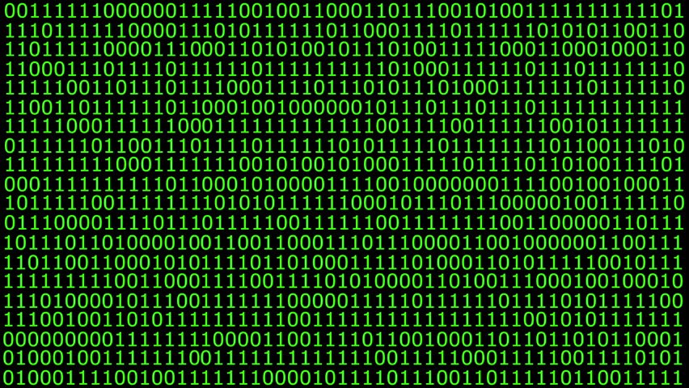

```{r xaringan-extras, echo=FALSE}
xaringanExtra::use_tile_view()
# xaringanExtra::use_share_again()
xaringanExtra::use_tachyons()
xaringanExtra::use_scribble(pen_color = "#035AA6")
xaringanExtra::use_extra_styles(
  hover_code_line = TRUE
)
```
```{r xaringan-themer, include=FALSE, warning=FALSE}
library(xaringanthemer)
style_duo_accent(
  primary_color = "#035AA6", secondary_color = "#03A696",
  link_color = "#03A696",
  header_font_google = google_font("Josefin Sans"),
  text_font_google   = google_font("Montserrat", "300", "300i"),
  code_font_google   = google_font("Fira Mono"),
  text_font_size = "1.35rem"
)
```

# Literate programming

.pull-left[
> An article [. . . ] in a scientific publication is not the scholarship
itself, it is merely advertising of the scholarship. The actual
scholarship is the complete software development environment and
the complete set of instructions which generated the figures
— Buckheit & Donoho (1995)

.footnote[Buckheit, J., & Donoho, D. L. (1995). WaveLab and reproducible research. In A. Antoniadis & G. Oppenheim (Eds.), *Wavelets and Statistics* (pp. 55–81). Springer-Verlag.
]
]
</img>

---

# Why use literate programming?

1. Direct connection between computations and presentation

1. Updating presentation is a breeze

1. Transparent and reproducible

1. Plain text less corruptable

1. Easily create different kinds of output styles and files

1. Easily switch between different templates

---

# File/document types

#### All files are collections of 1s and 0s

</img>

---

# File/document types

## Plain text

.pull-left[
* Only characters with no formatting

* Viewable in text editor

* Used for plain text storage (`.txt`, `.csv`) and coding (`.R`, `.Rmd`, `.py`, `.m`, `.cpp`)
]
</img>

---

# File/document types

## Binary

.pull-left[
* 1s and 0s are converted to something besides plain text (e.g, images, audio, formatted text)

* File type-specific program needed to decode file

* WYSIWYG

* Binary document files: `.docx`, `.xlsx`, `.pptx`, `.pdf`, `.png`, `.jpg`
]

</img>

---

# Markdown

#### Human-readable markup that can be converted to formatted file types

</img>

---

# Markdown

#### See [Markdown tutorial](https://commonmark.org/help/tutorial/) for Markdown syntax

--

### Comments

Markdown uses HTML syntax for comments `<!-- comment here -->`

--

### External links

* `[<link text>](<URL>)`
* `[Markdown tutorial](https://commonmark.org/help/tutorial/)`


---

# R Markdown

#### Human-readable markup that embeds R code and output into formatted file types

</img>

</img>

---

# From text to document

</img>
<figcaption, style = "font-size: .5rem; position:absolute; top: 95%; left: 48%">Source: <a href = "https://github.com/allisonhorst/stats-illustrations">Allison Horst</a></figcaption>

---

# Inline R code

#### Embed R code directly within your text with <code>&#96;r &#96;</code>

#### Code:

<code>The answer to 2 + 2 is &#96;r 2 + 2&#96;</code>


--

#### Output:

The answer to 2 + 2 is `r 2 + 2`.


---

# R code chunks

#### Write large chunks of R code outside of text

<code>&#96;&#96;&#96;{r}<br>norm <- rnorm(100, mean = 0, sd = 1)<br>&#96;&#96;&#96;</code>

---

# Figures

```{r echo = TRUE}
plot(1:10, 2:11)
```


---

# Tables

## Markdown

#### Code:
```
| A | B | C |
|---|---|---|
| 3 | 7 | 2 |
| 1 | 1 | 5 |
```

--

#### Output:
| A | B | C |
|---|---|---|
| 3 | 7 | 2 |
| 1 | 1 | 5 |

---

# Tables 

## .package[{knitr}]

--

```{r echo = TRUE}
species <- c("goldfish", "rats", "cats", "dogs")
sample_sizes <- c(112, 254, 83, 128)
species_means <- c(10.5, 12.3, 11.7, 23.9)
mydata <- data.frame(species, sample_sizes, species_means)
knitr::kable(mydata, col.names = c("Species", "N", "Means"))
```

---

# YAML headers

#### Configures aspects of the document

```
---
title: "Literate programming"
subtitle: "Data science and visualization in R"
author: "Jeff Stevens"
date: "'r Sys.Date()'"
output:
  xaringan::moon_reader:
    css: ["default", "default-fonts", "dsvr.css", "xaringan-themer.css"]
    lib_dir: libs
    nature:
      highlightStyle: tomorrow-night-eighties
      highlightLines: true
      countIncrementalSlides: false
      ratio: '16:9'
---
```


---

# LaTeX

### Document preparation system

</img>

* Plain text file with sophisticated markup to typeset output

* Developed to typeset math

* Very fine control of document element formatting

* Accepted as editable final manuscript type for many publishers

* Includes package to make PDF presentations (Beamer)

Unless you want LaTeX by itself, install [{tinytex}](https://yihui.org/tinytex/)


---

# LaTeX

</img>
<figcaption, style = "font-size: .5rem; position:absolute; top: 95%; left: 48%">Source: <a href = "https://github.com/allisonhorst/stats-illustrations">Allison Horst</a></figcaption>

---

# Why care about LaTeX?

1. Some compilation errors are from LaTeX not R Markdown/knitr

1. You can incorporate LaTeX code into R Markdown documents

1. There are some LaTeX options used by .package[{knitr}]

1. You can save the `.tex` file for journal publishers

--

#### But LaTeX code/options will not necessarily be rendered in HTML or Word document outputs

---

# Resources

### Markdown

* https://daringfireball.net/projects/markdown/
* https://www.markdownguide.org/cheat-sheet

### .package[{knitr}]

* https://yihui.name/knitr/

### LaTeX

* https://www.latex-project.org/
* https://www.overleaf.com/

---

# Homework

### For next class meeting

* Read [R4DS Ch. 27](https://r4ds.had.co.nz/r-markdown.html), [Markdown tutorial](https://commonmark.org/help/tutorial/)

* Install [.package[{tinytex}]](https://yihui.org/tinytex/)

* Install [.package[{papaja}]](https://github.com/crsh/papaja) from GitHub with `devtools::install_github("crsh/papaja")`


