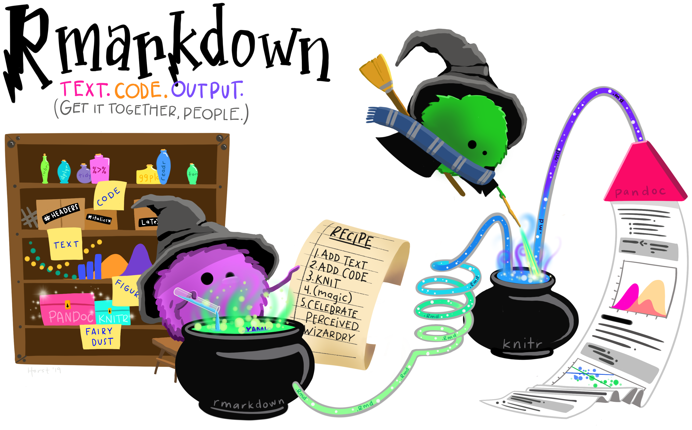

```{r xaringan-extras, echo=FALSE}
xaringanExtra::use_tile_view()
# xaringanExtra::use_share_again()
xaringanExtra::use_tachyons()
xaringanExtra::use_scribble(pen_color = "#035AA6")
xaringanExtra::use_extra_styles(
  hover_code_line = TRUE
)
```
```{r xaringan-themer, include=FALSE, warning=FALSE}
library(xaringanthemer)
style_duo_accent(
  primary_color = "#035AA6", secondary_color = "#03A696",
  link_color = "#03A696",
  header_font_google = google_font("Josefin Sans"),
  text_font_google   = google_font("Montserrat", "300", "300i"),
  code_font_google   = google_font("Fira Mono"),
  text_font_size = "1.35rem"
)
```

# R Markdown

</img>
<figcaption, style = "font-size: .5rem; position:absolute; top: 97%; left: 48%">Source: <a href = "https://github.com/allisonhorst/stats-illustrations">Allison Horst</a></figcaption>

---

# Review

### Literate programming

### File types (plain text vs. binary)

### Markdown basics

### R Markdown basics

### LaTeX

---

# Outline

### Review compiling docs, YAML headers, embedding R code

### R Markdown templates

### `{papaja}`

### Other documents

### Presentations

---

# Compiling documents

#### Open temporary session, then 

</img>

---

# YAML headers

---

# Embedding R code

## Inline R code

<code>&#96;r mean(x)&#96;</code>

## R code chunks

<code>&#96;&#96;&#96;{r}<br>mean(x)<br>&#96;&#96;&#96;</code>


---

# R Markdown templates

## Documents

* HTML

* PDF (LaTeX)

* DOCX


---

# {papaja} documents

---

# Other documents

* .package[{papaja}] revision letters

* [.package[{prereg}]](https://github.com/crsh/prereg) pre-registration files

* [.package[{rticles}]](https://github.com/rstudio/rticles) journal articles formatted for non-APA journals

---

# Presentations

* HTML
    - ioslides
    - Slidy
    - Xaringan

* PDF (Beamer/LaTeX)

* PowerPoint

---

# Other things

## References/bibliographies

* Zotero → BibTeX (preferably with Better BibTeX)

* Code: `Tidyverse rocks [@Wickham.Grolemund.2017].` 

* In-text citation: Tidyverse rocks (Wickham & Grolemund, 2017).

* References: Wickham, H., & Grolemund, G. (2017). R for data science. O’Reilly Media.

* CLS files format in-text citations and reference entries.

---

# Other things

## Cross-references

<code>&#96;&#96;&#96;{r myfig1}<br>plot(x)<br>&#96;&#96;&#96;</code>

```{r myfig1, include=F}
plot(1:10, 11:20)
```


* Code: `My results are available in Figure \@ref(fig:myfig1).`

* Text: My results are available in Figure 1.

---

# Resources

### R Markdown

* [Website](https://rmarkdown.rstudio.com/)
* [R Markdown: The Definitive Guide](https://bookdown.org/yihui/rmarkdown/)
* [R Markdown Cookbook](https://bookdown.org/yihui/rmarkdown-cookbook/)
* [Cheatsheet](https://raw.githubusercontent.com/rstudio/cheatsheets/master/rmarkdown-2.0.pdf)
* [Reference guide](https://www.rstudio.com/wp-content/uploads/2015/03/rmarkdown-reference.pdf)
* [R Markdown for Scientists](https://rmd4sci.njtierney.com/)
* [Writing Reproducible Research Papers with R Markdown](https://resulumit.com/teaching/rmd_workshop.html)

### .package[{papaja}]
* [GitHub](https://github.com/crsh/papaja)
* [Manual](http://frederikaust.com/papaja_man/)

---

# Homework

### Wrap-up this lesson

* Complete exercises

* Complete module check-in

### For next class meeting

* Read [R4DS Ch. 20](https://r4ds.had.co.nz/vectors.html)

* No presentation to watch

