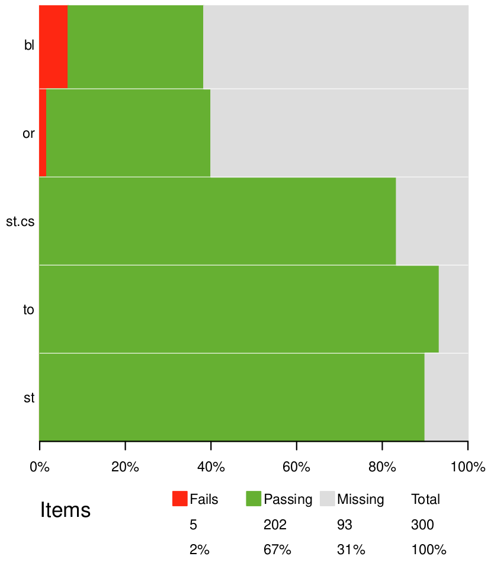
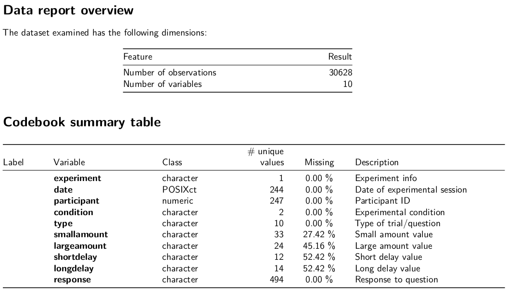
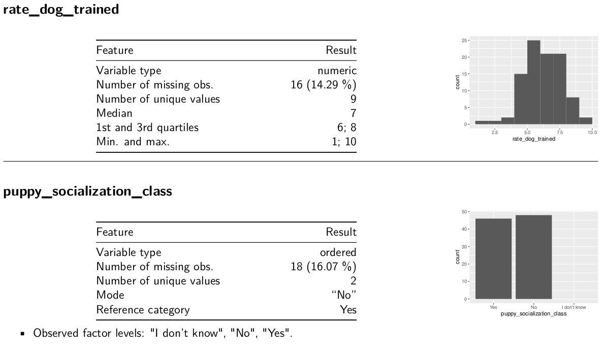

```{r xaringan-extras, echo=FALSE}
xaringanExtra::use_tile_view()
# xaringanExtra::use_share_again()
xaringanExtra::use_tachyons()
xaringanExtra::use_scribble(pen_color = "#035AA6")
xaringanExtra::use_extra_styles(
  hover_code_line = TRUE
)
```
```{r xaringan-themer, include=FALSE, warning=FALSE}
library(xaringanthemer)
style_duo_accent(
  primary_color = "#035AA6", secondary_color = "#03A696",
  link_color = "#03A696",
  header_font_google = google_font("Josefin Sans"),
  text_font_google   = google_font("Montserrat", "300", "300i"),
  code_font_google   = google_font("Fira Mono"),
  text_font_size = "1.35rem"
)
```

# Notes

* Check-in

* Exercise

* Create new column with `df$newcolumn <- vector` 
    - e.g., `df$condition <- rep(c("control", "experimental"), times = 10))`
    
* Early evaluation: [course feedback form](https://ssp.qualtrics.com/jfe/form/SV_a5DosbUb4FsimJU)

---

# Review

.pull-left[
### Data types
* Characters

* Integers (numeric)

* Doubles (numeric)

* Logicals

* Factors (augmented)

* Dates (augmented)
]

.pull-right[
### Data structures
* Vectors (atomic vectors)

* Matrices (2D atomic vectors)

* Lists (recursive vectors)

* Data frames (rectangular lists)

* Tibbles (special data frames)
]

---

# Outline

### Importing data

### Exporting data

### Data validation

### Data dictionaries

---

# Importing data

### File types

* Excel (`.xls`/`.xlsx`): Binary matrix file with formatting, formulas, multiple sheets

--

* Comma-separated values (`.csv`): Plain text matrix file without formatting, etc. (also TSV)

--

* Other program-specific files: SPSS, SAS, etc.

--

* Text files (`.txt`): Plain text file of raw text

--

* Start saving CSVs and convert other formats to CSVs

---

# Importing data

## Controling working directories and paths

### [.package[{here}]](https://here.r-lib.org/) 

--

* Uses project-relative paths

```{r echo = FALSE, message = FALSE}
library(here)
```

```{r eval = FALSE}
library(here)
knitr::include_graphics("docs/meetings/images/tidyverse_hex.png")
knitr::include_graphics(here("docs/meetings/images/tidyverse_hex.png"))
```

---

# CSV

### Base R: `read.csv()`

#### Wrapper around `read.table()`

#### Defaults
* Header row (turn off with `header = FALSE`)

* Comma separated (change with `sep=";"` or use `read.csv2()`)

* Outputs data frame

--

#### Usage: `read.csv(file = "path/to/file.csv")`

```{r}
mydf <- read.csv(here("data/penguins.csv"))
```


---

# CSV

### .package[{readr}] from .package[{tidyverse}]: `read_csv()`

</img>

--

* Control column names with `col_names` (including renaming)

* Control column types with `col_types`

* Control missing values with `na` and `quoted_na`

* Can skip rows before reading data with `skip` or cut off with `n_max`

* Outputs tibble

--

#### Usage: `read_csv(file = "path/to/file.csv")`

```{r}
library(readr)
mydf2 <- read_csv(here("data/penguins.csv"))
```

---

# CSV

## URLs

You can use both `read.csv()` and `read_csv()` to import CSV files available online by using the URL as the path.

```{r eval = FALSE}
mydf3 <- read.csv("https://decisionslab.unl.edu/data/stevens_etal_2020_obed_data1.csv")
mydf4 <- read_csv("https://decisionslab.unl.edu/data/stevens_etal_2020_obed_data1.csv")
```

---

# Excel data

## Import Excel data with [.package[{readxl}]](https://readxl.tidyverse.org/)

</img>

--

* Functions: `read_xls()`, `read_xlsx()`, `read_excel()`

* Specify sheets with `sheets` argument

* Specify subset of cells with `range` argument

* Like `read_csv()`, has `col_names`, `col_types`, `na`, `skip`, `n_max`

--

#### Usage: `read_excel(path = "path/to/file.csv")`

```{r}
library(readxl)
mydf5 <- read_excel(here("data/penguins.xlsx"), sheet = "Sheet2")
```


---

# Other stats packages

## Import data from SPSS, SAS, & Stata with [.package[{haven}]](https://haven.tidyverse.org/)

</img>
--

### SPSS
`read_sav("mtcars.sav")`

### SAS
`read_sas("mtcars.sas7bdat")`

### Stata
`read_dta("mtcars.dta")`

---

# Qualtrics data

## Import Qualtrics data directly with [.package[{qualtRics}]](https://docs.ropensci.org/qualtRics/)

--

1. Register your Qualtrics credentials with `qualtrics_api_credentials()`<sup>*</sup>

1. Get survey ID by viewing `all_surveys()`

1. Import data with `fetch_survey()`

1. Never have to download Qualtrics data again!

.footnote[*Be cautious with using API credentials! I'm not responsible for the security of packages that I describe.]

---

# Qualtrics data

## Import Qualtrics data directly with [.package[{qualtRics}]](https://docs.ropensci.org/qualtRics/)

* Save an RDS version of data with `save_dir`

* Download choice text by default or numeric values with `label = FALSE`

* Force rewrite of existing file with `force_request = TRUE`

* Set time zone with `time_zone = "America/Chicago"`

* Turn off sublabels with `add_var_labels = FALSE`

--

#### Usage

```{r eval = FALSE}
mydf6 <- fetch_survey("SV_xxxxxxxxxxxxx", save_dir = "data", label = FALSE, convert = FALSE, 
             force_request = TRUE, time_zone = "America/Chicago")
```

---

# Cloud storage

## Import data directly from cloud storage
* OneDrive [.package[{Microsoft365R}]](https://github.com/Azure/Microsoft365R)<sup>*</sup>

* Google sheets [.package[{googlesheets4}]](https://googlesheets4.tidyverse.org/)<sup>*</sup>

* Box [.package[{boxr}]](https://r-box.github.io/boxr/)<sup>*</sup>

.footnote[*Be cautious with using API credentials! I'm not responsible for the security of packages that I describe.]

</img>

---

# Exporting data

### `write.csv()`

* Character/factor columns in quotes with `quote = TRUE`

* Remove row/column names with `row.names = FALSE` or `col.names = FALSE`

--

### `write_csv()`

* Characters are only quoted if they contain a comma, quote, or new line

--

#### Usage

```{r}
write.csv(mydf, here("data/newdata.csv"))
write_csv(mydf, here("data/newdata2.csv"))
```

---

# Working with native R data

* Fast to restore

* Maintains R-specific information

--

## Data files

* `.rds` binary files with single object

* Read/write with `readRDS` and `saveRDS`

---

# Working with native R data

* Fast to restore

* Maintains R-specific information

## Workspaces

* `.Rdata` binary files contain multiple objects or entire workspace

* Save objects with `save(object1, object2, file = "filename.Rdata")`

* Save workspace with `save.image("filename.Rdata")`

* Open with `load("filename.Rdata")`

---

# Data validation

#### You need to check that your imported data are correct/valid/reasonable

--

* Dimensions

* Data types

* Ranges and constraints

* Allowed values (code lists)

* Column dependencies

* Completeness/uniqueness

* Missing values

--

#### Hadley says that if you get a bug once, write in a test for it!

---

# Data validation

## [.package[{skimr}]](https://docs.ropensci.org/skimr/)

#### View info about your data

```{r}
library(skimr)
skim(mydf2)
```


---

# Data validation

## [.package[{validate}]](https://github.com/data-cleaning/validate)

.pull-left[
* Create **rules** about dimensions, data types, ranges, code lists, etc.

* Confront your data with the rules

* Summarize/visualize validation
]

</img>


---

# Testing

--

## Assertions: tests of data embedded in functions

### [.package[{assertr}]](https://cran.r-project.org/web/packages/assertr/vignettes/assertr.html)
### [.package[{assertthat}]](https://github.com/hadley/assertthat)

--

## Unit testing: separate test of function functionality
### [.package[{testthat}]](https://github.com/hadley/testthat)

</img>

---

# Data dictionaries

--

## [.package[{dataReporter}]](https://github.com/ekstroem/dataReporter)

--

</img>

---

# Data dictionaries

## [.package[{dataReporter}]](https://github.com/ekstroem/dataReporter)

</img>

---

# Data dictionaries

## [.package[{dataReporter}]](https://github.com/ekstroem/dataReporter)

```{r eval = FALSE}
dataReporter::makeCodebook(mydf3, file = here("docs/inclass_demos/06_codebook.Rmd"))
```

---

# Summary

### Importing data

### Exporting data

### Data validation

### Data dictionaries

---

# Resources

* [The Data Validation Cookbook](https://data-cleaning.github.io/validate/)

* [Data import cheatsheet](https://github.com/rstudio/cheatsheets/raw/master/data-import.pdf)

---

# Homework

### Wrap-up this lesson

* Complete exercises

* Complete module check-in

### For next class meeting

* Read [R4DS Ch. 5.1, 5.4, 5.5](https://r4ds.had.co.nz/transform.html) (note slightly out of order)

* Watch cleaning columns presentation

* I will be on Zoom for office hours during our scheduled class meeting on 2021-05-31. I will not present material but will answer questions/work through problems.
