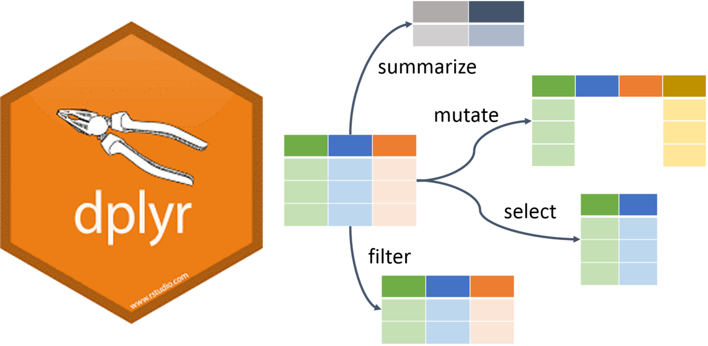
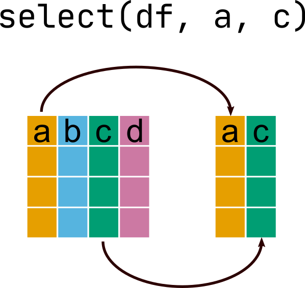
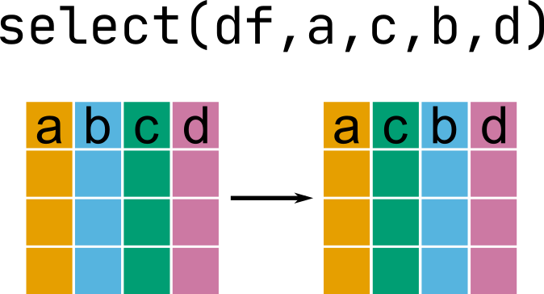
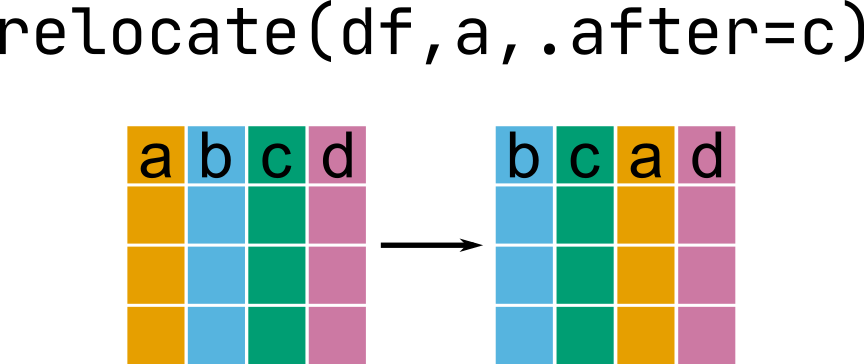
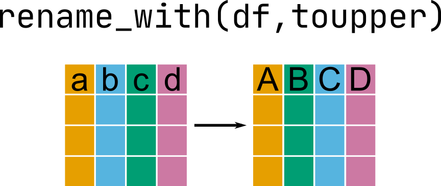
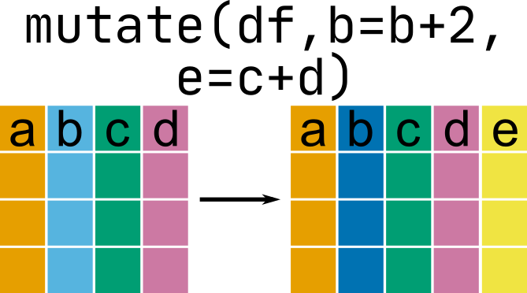

```{r xaringan-extras, echo=FALSE}
xaringanExtra::use_tile_view()
# xaringanExtra::use_share_again()
xaringanExtra::use_tachyons()
xaringanExtra::use_scribble(pen_color = "#035AA6")
xaringanExtra::use_extra_styles(
  hover_code_line = TRUE
)
```
```{r xaringan-themer, include=FALSE, warning=FALSE}
library(xaringanthemer)
style_duo_accent(
  primary_color = "#035AA6", secondary_color = "#03A696",
  link_color = "#03A696",
  header_font_google = google_font("Josefin Sans"),
  text_font_google   = google_font("Montserrat", "300", "300i"),
  code_font_google   = google_font("Fira Mono"),
  text_font_size = "1.35rem"
)
```

# Review

### Importing data

### Exporting data

### Data validation

### Data dictionaries

---

# Data wrangling

```{r, message = FALSE}
library(dplyr)
```

</img>

</img>

<figcaption, style = "font-size: .5rem; position:absolute; top: 97%; left: 48%">Source: <a href = "https://github.com/allisonhorst/stats-illustrations">Allison Horst</a></figcaption>

---

# Data wrangling

```{r, message = FALSE}
library(dplyr)
```

</img>

</img>

---

# Today

### Selecting, moving, and renaming columns

### Changing and creating columns

--

# Next

### Filtering and sorting rows

### Summarizing data

---

# Data set

```{r}
library(nycflights13)
glimpse(flights)
```


---

# Data set

```{r}
library(nycflights13)
head(flights)
```


---

# Selecting columns

## `select()`

</img>

---

# Selecting columns

## `select()`

### By inclusion

```{r}
select(flights, year, month, day, sched_dep_time, sched_arr_time)
```


---

# Selecting columns

## `select()`

### By exclusion

```{r}
select(flights, -dep_time, -dep_delay, -arr_time, -arr_delay, -carrier, -flight, -tailnum,
       -origin, -dest, -air_time, -distance, -hour, -minute, -time_hour)
```

---

# Selecting columns

## Helper functions

### Select consecutive columns with `:` 

```{r}
select(flights, year:day, hour, time_hour)
```

---

# Selecting columns

## Helper functions

### Select everything else with `everything()`

```{r}
select(flights, time_hour, air_time, everything())
```

---

# Selecting columns

## Helper functions

### Select columns containing specific text with `contains()`

```{r}
select(flights, contains("_time"))
```

---

# Selecting columns

## Helper functions

### Select columns starting or ending with text with `starts_with()` or `ends_with()`

```{r}
select(flights, starts_with("dep_"))
```

---

# Moving columns

## `select()`

</img>

---

# Moving columns

## `select()`

```{r}
select(flights, carrier, flight, year:day)
```


---

# Moving columns

## `relocate()`

</img>

---

# Moving columns

## `relocate()`

```{r}
relocate(flights, carrier, flight, .before = year)
```


---

# Renaming columns

## `select()`

```{r}
select(flights, airline = carrier, flight_num = flight, everything())
```


---

# Renaming columns

## `rename()`

</img>

---

# Renaming columns

## `rename()`

```{r}
rename(flights, departure = dep_time, arrival = arr_time)
```

---

# Changing and creating columns

## `mutate()`

</img>

---

# Changing existing columns

## `mutate()`

```{r}
mutate(flights, month = as.character(month))
```

---

# Changing existing columns

## `mutate()`

```{r echo = FALSE}
convert_time <- function(x) {
  x <- as.character(x)
  min <- stringr::str_sub(x, start = -2)
  if (stringr::str_length(min) == 1) {
    min <- paste("0", min, sep = "")
  }
  hour <- stringr::str_sub(x, start = -4, end = -3)
  if (hour == "") {
    hour = "00"
  } else if (stringr::str_length(hour) == 1) {
    hour <- paste("0", hour, sep = "")
  }
  paste(hour, min, sep = ":")
}
```

```{r warning = FALSE}
mutate(flights, dep_time = convert_time(dep_time))

```

---

# Creating columns

## `mutate()`

```{r}
mutate(flights, flight_time = arr_time - dep_time)
```

---

# Creating columns

## `mutate()`

```{r}
mutate(flights, flight_time = arr_time - dep_time) %>% 
  relocate(flight_time, .after = arr_time)
```

---

# Applying functions to multiple columns

```{r}
mutate(flights, min_dep_time = min(dep_time, sched_dep_time, na.rm = TRUE)) %>% 
  relocate(min_dep_time, .after = arr_time)
```

---

# Applying functions to multiple columns

## `rowwise()`

```{r}
rowwise(flights) %>% 
mutate(min_dep_time = min(dep_time, sched_dep_time)) %>% 
  relocate(min_dep_time, .after = arr_time)
```

---

# Changing multiple columns

## `across()`

```{r warning = FALSE}
mutate(flights, across(contains("_time"), convert_time))
```

---

# Summary

### Selecting, moving, and renaming columns
* `select()` and helpers
* `relocate()`
* `rename()`

### Changing and creating columns
* `mutate()`
* `across()`

---

# Homework

### Wrap-up this lesson

* Complete exercises

* I will be on Zoom for office hours during our scheduled class meeting on 2021-05-31. I will not present material but will answer questions/work through problems.

### For next class meeting

* Read [R4DS Ch. 5.2, 5.3, 5.6](https://r4ds.had.co.nz/transform.html)

