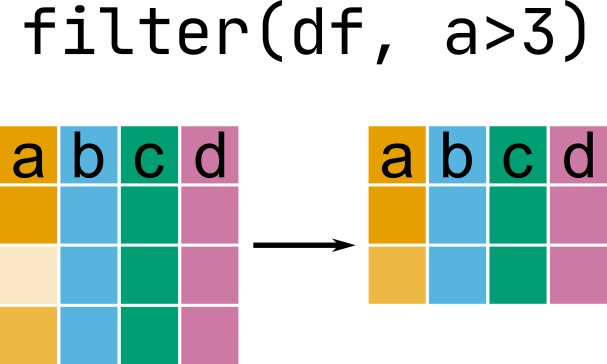
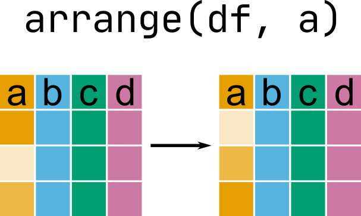

```{r xaringan-extras, echo=FALSE}
xaringanExtra::use_tile_view()
# xaringanExtra::use_share_again()
xaringanExtra::use_tachyons()
xaringanExtra::use_scribble(pen_color = "#035AA6")
xaringanExtra::use_extra_styles(
  hover_code_line = TRUE
)
```
```{r xaringan-themer, include=FALSE, warning=FALSE}
library(xaringanthemer)
style_duo_accent(
  primary_color = "#035AA6", secondary_color = "#03A696",
  link_color = "#03A696",
  header_font_google = google_font("Josefin Sans"),
  text_font_google   = google_font("Montserrat", "300", "300i"),
  code_font_google   = google_font("Fira Mono"),
  text_font_size = "1.35rem"
)
```

# Review

### Selecting, moving, and renaming columns
* `select()` and helpers
* `relocate()`
* `rename()`

### Changing and creating columns
* `mutate()`
* `across()`

---
# Today

### Filtering and sorting rows

### Summarizing data

---

# {dplyr} and data set

```{r, message = FALSE}
library(dplyr)
library(nycflights13)
head(flights)
```

---

# Filtering rows

## `filter()`

</img>


---

# Filtering rows

## `filter()`

```{r}
filter(flights, dep_time == sched_dep_time)
```

---

# Filtering rows

## `filter()`

```{r}
filter(flights, dep_delay < 0 & month != 1)
```

---

# Filtering rows

## `filter()`

```{r}
filter(flights, month == 11 | month == 12)
```

---

# Filtering rows

## `filter()`

```{r}
filter(flights, month %in% c(11, 12))
```

---

# Filtering rows

## Check if `NA` with `is.na()`

.pull-left[
```{r}
flights2 <- flights
flights2[1:5, 1] <- NA
flights2[, 1:5]
```
]

.pull-right[
```{r}
filter(flights2, !is.na(year))[, 1:5]
```

]

---

# Sorting rows

## `arrange()`

</img>

---

# Sorting rows

## `arrange()`

```{r}
arrange(flights, sched_dep_time)
```

---

# Sorting rows

## `arrange()`

```{r}
arrange(flights, sched_dep_time, dep_time, sched_arr_time)
```


---

# Summarizing data

## `summarise()`

</img>

---

# Summarizing data

## `summarise()`

```{r}
summarise(flights, mean_dep_delay = mean(dep_delay), 
          sd_dep_delay = sd(dep_delay),
          n_dep_delay = length(dep_delay))
```

--

```{r}
summarise(flights, mean_dep_delay = mean(dep_delay, na.rm = TRUE),
          sd_dep_delay = sd(dep_delay, na.rm = TRUE),
          n_dep_delay = length(dep_delay))
```

---

# Summarizing multiple columns

## `summarise()+across()`

```{r}
summarise(flights, across(contains("_time"), mean))
```

--

```{r}
summarise(flights, across(contains("_time"), ~mean(.x, na.rm = TRUE)))
```

---

# Summarizing multiple columns

## `summarise()+across()`

#### Multiple functions

```{r}
summarise(flights, across(contains("_time"), 
                          list(mean = ~mean(.x, na.rm = TRUE), sd = ~sd(.x, na.rm = TRUE))))
```

---

# Grouping data

## `group_by()`

```{r}
group_by(flights, month)
```

---

# Grouping data

### Remove groups with `ungroup()`

```{r}
group_by(flights, month) %>% 
  ungroup()
```

---

# Summarizing groups of data

## `summarise()+group_by()`

```{r}
group_by(flights, carrier) %>% 
  summarise(mean_carrier_delay = mean(dep_delay, na.rm = TRUE), 
            sd_carrier_delay = sd(dep_delay, na.rm = TRUE))
```

---

# Combining commands

## The pipe `%>%` in [.package[{magrittr}]](https://magrittr.tidyverse.org/)

#### Allows series of commands without having to save intermediate objects

```{r}
flights %>% 
  select(year:dep_delay, origin) %>% # include these columns
  select(-sched_dep_time) %>% # can't include and exclude in same select
  relocate(origin, .after = day) %>% # move origin
  rename(origin_airport = origin) %>% # rename origin
  mutate(dep_delay_hours = dep_delay / 60) %>% # create new column
  filter(origin_airport == "JFK") %>% # filter rows based on origin_airport
  arrange(dep_delay) # sort by dep_delay
```

---

# Combining commands

## The pipe `%>%` in [.package[{magrittr}]](https://magrittr.tidyverse.org/)

#### Start with the data object...

```{r eval = FALSE}
flights %>% 
  select(year:dep_delay, origin) %>% # include these columns
  select(-sched_dep_time)
```

#### Or use it as the first argument...

```{r, eval = FALSE}
select(flights, year:dep_delay, origin) %>% # include these columns
  select(-sched_dep_time)
```

#### But don't use it after pipe

---

# Combining commands

.pull-left[
#### Like any object, assigning it does not output to console

```{r}
myflights <- flights %>% 
  select(year:dep_delay, origin) %>%
  select(-sched_dep_time)
```

#### But omitting assignment does

```{r}
flights %>% 
  select(year:dep_delay, origin) %>%
  select(-sched_dep_time)
```
]

--

.pull-right[
#### As does wrapping assignment in parentheses

```{r}
(myflights <- flights %>% 
  select(year:dep_delay, origin) %>%
  select(-sched_dep_time))
```
]

---

# Summary

.pull-left[
### Selecting, moving, and renaming columns
* `select()` and helpers
* `relocate()`
* `rename()`

### Changing and creating columns
* `mutate()`
* `across()`
]

.pull-right[
### Filtering and sorting rows
* `filter()`
* `arrange()`

### Summarizing data
* `summarise()`
* `group_by()`

### Combining data
* ` %>% `

]
---

# Resources

* [Software Carpentry Dataframe Manipulation with dplyr](https://ucsbcarpentry.github.io/2020-10-09-ReprodR-online/13-dplyr/index.html)

* [PsyTeachR Data Wrangling](psyteachr.github.io/ug1-practical/data-wrangling-1.html)


---

# Homework

### Wrap-up this lesson

* Complete exercises

### For next class meeting

* Read [R4DS Ch. 12](https://r4ds.had.co.nz/tidy-data.html)
