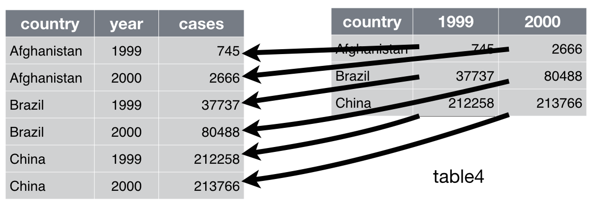
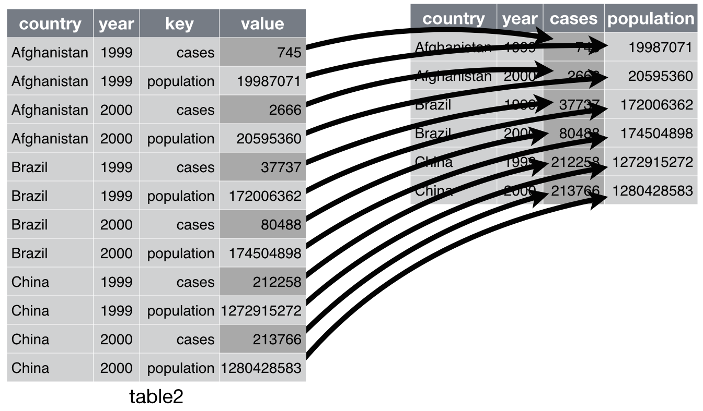
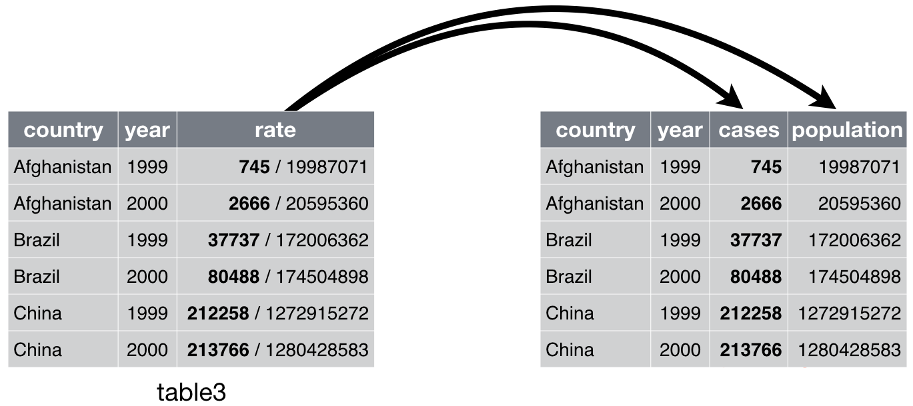

```{r xaringan-extras, echo=FALSE}
xaringanExtra::use_tile_view()
# xaringanExtra::use_share_again()
xaringanExtra::use_tachyons()
xaringanExtra::use_scribble(pen_color = "#035AA6")
xaringanExtra::use_extra_styles(
  hover_code_line = TRUE
)
```
```{r xaringan-themer, include=FALSE, warning=FALSE}
library(xaringanthemer)
style_duo_accent(
  primary_color = "#035AA6", secondary_color = "#03A696",
  link_color = "#03A696",
  header_font_google = google_font("Josefin Sans"),
  text_font_google   = google_font("Montserrat", "300", "300i"),
  code_font_google   = google_font("Fira Mono"),
  text_font_size = "1.35rem"
)
```

# Review

.pull-left[
### Selecting, moving, and renaming columns
* `select()` and helpers
* `relocate()`
* `rename()`

### Changing and creating columns
* `mutate()`
* `across()`
]

.pull-right[
### Filtering and sorting rows
* `filter()`
* `arrange()`

### Summarizing data
* `summarise()`
* `group_by()`
]

---
# Today

### Pivoting data between long and wide

### Separating, uniting, and coalescing data

### Dealing with incomplete data sets

---

# Tidying data with {tidyr} and {dplyr}

```{r, message = FALSE}
library(tidyr)
library(dplyr)
```

</img>

</img>

</img>

<figcaption, style = "font-size: .5rem; position:absolute; top: 97%; left: 78%">Source: <a href = "https://github.com/allisonhorst/stats-illustrations">Allison Horst</a></figcaption>

---

# What is tidy data?


1. Each variable has its own column

1. Each observation has its own row

1. Each value has its own cell

</img>

---

# Tidy data

#### Every variable is a column, every observation is a row, and every value is a cell

.pull-left[
```{r}
library(tidyr)
table1
```
]

--

.pull-right[
```{r}
table2
```
]

---

# Tidy data

#### Every variable is a column, every observation is a row, and every value is a cell

```{r}
table3
```

---

# Tidy data

#### Every variable is a column, every observation is a row, and every value is a cell

.pull-left[
```{r}
table4a
```
]

.pull-right[
```{r}
table4b
```
]

---

# Tidy data

* Think about tidy from a model perspective

* Tidyverse assumes tidy data

* Easier to analyze and plot tidy data


---

# Tidy data

* But sometimes easier to store non-tidy data

.pull-left[
```{r echo = FALSE}
set.seed(20210514)
hai_data1 <- tibble(id = rep(1:5, each = 2), age = rep(round(rnorm(5, 20, 1)), each = 2), pre_post = rep(c("Pre", "Post"), 5), nback = round(rnorm(10, 0, 1), 2))
```
```{r}
hai_data1
```
]

--

.pull-right[
```{r echo = FALSE}
hai_data2 <- tibble(id = rep(100:104, each = 2), age = rep(round(rnorm(5, 20, 1)), each = 2), pre_post = rep(c("Pre", "Post"), 5), nback = round(rnorm(10, 0, 1), 2), panas = round(rnorm(10, 2.5, 1), 2), span = round(rnorm(10, 6, 1.5)))
```
```{r}
hai_data2
```
]

---

# Tidy data

.pull-left[
```{r echo = FALSE, message = FALSE}
library(tidyverse)
hai_data_combined <- bind_rows(hai_data1, hai_data2)
```
```{r}
hai_data_combined
```
]

--

.pull-right[
```{r echo = FALSE}
hai_data1_long <- pivot_longer(hai_data1, -c(id, age, pre_post), names_to = "measure", values_to = "response")
hai_data2_long <- pivot_longer(hai_data2, -c(id, age, pre_post), names_to = "measure", values_to = "response")
hai_data_combined_long <- bind_rows(hai_data1_long, hai_data2_long)
```
```{r}
head(hai_data_combined_long, 20)
```
]


---

# Pivoting data

</img>

---

# Pivoting data

</img>

<figcaption, style = "font-size: .5rem; position:absolute; top: 97%; left: 78%">Source: <a href = "https://github.com/gadenbuie/tidyexplain">Garrick Aden-Buie</a></figcaption>

---

# Pivot longer

.pull-left[
```{r}
table4a
```
]

.pull-right[
#### Why is `table4a` not tidy?
]

--

</img>

---

# Pivot longer

#### Use `pivot_longer()`

```{r}
pivot_longer(table4a, cols = c(`1999`, `2000`), names_to = "year", values_to = "cases")
```

</img>


---

# Pivot wider

.pull-left[
```{r}
table2
```
]

.pull-right[
#### Why is `table2` not tidy?

]

--

</img>

---

# Pivot wider

#### Use `pivot_wider()`

```{r}
pivot_wider(table2, names_from = type, values_from = count)
```

</img>


---

# Separating data

.pull-left[
```{r}
table3
```
]

.pull-right[
#### Why is `table3` not tidy?
]

--

</img>

---

# Separating data

```{r}
separate(table3, rate, into = c("cases", "population"))
```

--

```{r}
separate(table3, rate, into = c("cases", "population"), convert = TRUE)
```

---

# Separating data

```{r}
separate(table3, year, into = c("century", "year"), sep = 2)
```

---

# Uniting data

.pull-left[
```{r}
table5
```
]

.pull-right[
#### Why is `table5` not tidy?
]

--

</img>

---

# Uniting data

```{r}
unite(table5, new, century, year)
```

--

```{r}
unite(table5, new, century, year, sep = "")
```

---

# Coalescing data

```{r echo = FALSE}
coal_data <- tibble(a_1 = c(1, NA, NA, NA), a_2 = c(NA, 4, NA, NA), a_3 = c(NA, NA, 7, NA))
```
```{r}
coal_data
```

--

```{r}
coal_data %>% 
  mutate(a_all = coalesce(!!! select(., contains("a_"))))
```

---

# Incomplete data sets

## Missing data

```{r echo = FALSE}
stocks <- tibble(
  year   = c(2015, 2015, 2015, 2015, 2016, 2016, 2016),
  qtr    = c(   1,    2,    3,    4,    2,    3,    4),
  return = c(1.88, 0.59, 0.35,   NA, 0.92, 0.17, 2.66)
)
```

.pull-left[
```{r}
stocks
```

* Explicitly missing (Q4 2015 is NA)
* Implicitly missing (Q1 2016 absent)
]

--

.pull-right[
```{r}
stocks %>% 
  complete(year, qtr)
```
]

#### Important for factorial designs and for data validation

---

# Incomplete data sets

## Combinations of factors

```{r echo = FALSE}
fruits <- tibble(
  type   = c("apple", "orange", "apple", "orange", "orange", "orange"),
  year   = c(2010, 2010, 2012, 2010, 2010, 2012),
  size  =  factor(
    c("XS", "S",  "M", "S", "S", "M"),
    levels = c("XS", "S", "M", "L")
  ),
  weights = rnorm(6, as.numeric(size) + 2)
)
```

.pull-left[
```{r}
fruits
```
]

--

.pull-right[
```{r}
fruits %>% expand(type, size)
```
]

---

# Incomplete data sets

## Combinations of factors

.pull-left[
```{r}
fruits %>% expand(type, size, year)
```
]

--

.pull-right[
```{r}
fruits %>% expand(nesting(type, size))
```
]

---

# Incomplete data sets

## Filling data

```{r echo = FALSE}
treatment <- tribble(
  ~ person,           ~ treatment, ~response,
  "Derrick Whitmore", 1,           7,
  NA,                 2,           10,
  NA,                 3,           9,
  "Katherine Burke",  1,           4
)
```

.pull-left[
```{r}
treatment
```
]

--

.pull-right[
```{r}
treatment %>% 
  fill(person)
```
]

---

# Summary

### Pivoting data
* `pivot_longer()`

* `pivot_wider()`

### Separating, uniting, and coalescing

### Incomplete data sets
* Factorial combinations

* Filling in data

---

# Resources

* [Software Carpentry Dataframe Manipulation with tidyr](https://ucsbcarpentry.github.io/2020-10-09-ReprodR-online/14-tidyr/index.html)

* [PsyTeachR Reshaping Data](https://psyteachr.github.io/ug1-practical/reshaping-data.html)

* [Non-tidy data](https://simplystatistics.org/2016/02/17/non-tidy-data/)


---

# Homework

### Wrap-up this lesson

* Complete exercises

### For next class meeting

* Read [R4DS Ch. 13](https://r4ds.had.co.nz/relational-data.html)
