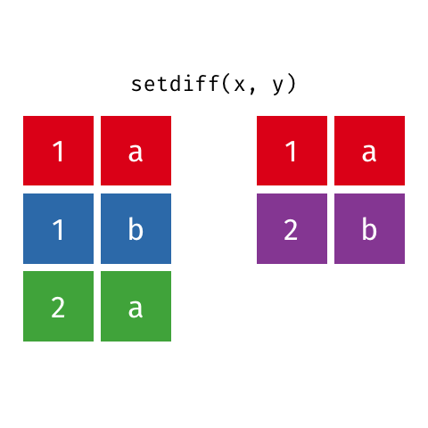

```{r xaringan-extras, echo=FALSE}
xaringanExtra::use_tile_view()
# xaringanExtra::use_share_again()
xaringanExtra::use_tachyons()
xaringanExtra::use_scribble(pen_color = "#035AA6")
xaringanExtra::use_extra_styles(
  hover_code_line = TRUE
)
```
```{r xaringan-themer, include=FALSE, warning=FALSE}
library(xaringanthemer)
style_duo_accent(
  primary_color = "#035AA6", secondary_color = "#03A696",
  link_color = "#03A696",
  header_font_google = google_font("Josefin Sans"),
  text_font_google   = google_font("Montserrat", "300", "300i"),
  code_font_google   = google_font("Fira Mono"),
  text_font_size = "1.35rem"
)
```

# Review

### Pivoting data
* `pivot_longer()`

* `pivot_wider()`

### Separating, uniting, and coalescing

### Incomplete data sets
* Factorial combinations

* Filling in data

---

# Today

### Adding rows and columns

### Mutating joins

### Filtering joins

### Set operations

---

# Merging data with {dplyr}

```{r, message = FALSE}
library(dplyr)
```

</img>

</img>
</img>

</img>

<figcaption, style = "font-size: .5rem; position:absolute; top: 97%; left: 58%">Source: <a href = "https://github.com/gadenbuie/tidyexplain">Garrick Aden-Buie</a></figcaption>

---

# Adding rows with `add_row()`

.pull-left[
```{r}
df <- tibble(x = 1:3, y = 3:1)
df
```

```{r}
df %>% add_row(x = 4, y = 0)

```
]

.pull-right[
```{r}
df %>% add_row(x = 4, y = 0, .before = 2)
```


```{r}
df %>% add_row(x = 4:5, y = 0:-1)
```
]

---

# Add rows with `bind_rows()`

.pull-left[
```{r}
df2 <- tibble(x = 4:5, y = 5:4)
df2
```

```{r}
bind_rows(df, df2)
```
]

.pull-right[
```{r}
df3 <- tibble(x = 6:7, y = 7:6, z = c("A", "B"))
df3
```


```{r}
bind_rows(df, df3)
```
]

---

# Add columns with `bind_cols()`

.pull-left[
```{r}
df4 <- tibble(z = c("A", "B" , "C"), zz = c("Z", "Y", "X"))
df4
```


```{r}
bind_cols(df, df4)
```
]

.pull-right[
```{r}
bind_cols(df, new_col = df4$z)
```
]

---

# Merging data

.pull-left[
```{r echo = FALSE}
set.seed(20210518)
hai_data <- tibble(id = rep(1:5, each = 2), age = rep(round(rnorm(5, 20, 1)), each = 2), pre_post = rep(c("Pre", "Post"), 5), nback = round(rnorm(10, 0, 1), 2))

```

```{r}
hai_data
```
]

.pull-right[
```{r echo = FALSE}
hr_data <- tibble(id = rep(c(3:5), each = 2), pre_post = rep(c("Pre", "Post"), 3), hr = round(rnorm(6, 100, 10)))
interest_data <- tibble(id = 1:5, percent = c(100, 80, 75, 95, 100))
```

```{r}
hr_data
interest_data
```

]


---

# Merging data

```{r}
library(nycflights13)
```

</img>

---

# Keys

* Unique identifiers of observations

* Keys may take some work to clean first

* Double check keys for uniqueness/duplicates

* Create **surrogate key** if no primary key exists

---

# Joins

</img>
</img>

---

# Mutating joins

#### Affect columns (kinda like `bind_cols()`)

</img>

---

# Mutating joins

#### Affects columns

</img>

---

# Inner joins

#### Keep only matching observations

</img>

--

</img>

---

# Inner joins

</img>

```{r echo = FALSE}
x <- tribble(
  ~key, ~val_x,
     1, "x1",
     2, "x2",
     3, "x3"
)
y <- tribble(
  ~key, ~val_y,
     1, "y1",
     2, "y2",
     4, "y3"
)
```

.pull-left[
```{r}
x
y
```
]

.pull-right[
```{r}
inner_join(x, y, by = "key")

```

```{r}
x %>% 
  inner_join(y, by = "key")
```
]

---

# Outer joins

.pull-left[
#### Keep observations that appear in at least one of the tables

* Left

* Right

* Full
]

</img>

---

# Left joins

#### Keep only left observations

</img>

--

</img>

---

# Left joins

</img>

```{r echo = FALSE}
x <- tribble(
  ~key, ~val_x,
     1, "x1",
     2, "x2",
     3, "x3"
)
y <- tribble(
  ~key, ~val_y,
     1, "y1",
     2, "y2",
     4, "y3"
)
```

.pull-left[
```{r}
x
y
```
]

.pull-right[
```{r}
left_join(x, y, by = "key")

```
]

---

# Right joins

#### Keep only right observations

</img>

--

</img>

---

# Right joins

</img>

```{r echo = FALSE}
x <- tribble(
  ~key, ~val_x,
     1, "x1",
     2, "x2",
     3, "x3"
)
y <- tribble(
  ~key, ~val_y,
     1, "y1",
     2, "y2",
     4, "y3"
)
```

.pull-left[
```{r}
x
y
```
]

.pull-right[
```{r}
right_join(x, y, by = "key")

```
]

---

# Full joins

#### Keep all observations

</img>

--

</img>

---

# Full joins

</img>

```{r echo = FALSE}
x <- tribble(
  ~key, ~val_x,
     1, "x1",
     2, "x2",
     3, "x3"
)
y <- tribble(
  ~key, ~val_y,
     1, "y1",
     2, "y2",
     4, "y3"
)
```

.pull-left[
```{r}
x
y
```
]

.pull-right[
```{r}
full_join(x, y, by = "key")

```
]

---

# Filtering joins

#### Affect rows

</img>

---

# Semi joins

#### Keep only matching observations

</img>

--

</img>

#### Useful to include subset of participants

---

# Semi joins

</img>

```{r echo = FALSE}
x <- tribble(
  ~key, ~val_x,
     1, "x1",
     2, "x2",
     3, "x3"
)
y <- tribble(
  ~key, ~val_y,
     1, "y1",
     2, "y2",
     4, "y3"
)
```

.pull-left[
```{r}
x
y
```
]

.pull-right[
```{r}
semi_join(x, y, by = "key")

```
]

---

# Anti joins

#### Keep only non-matching observations

</img>

--

</img>

#### Useful to exclude subset of participants

---

# Anti joins

</img>

```{r echo = FALSE}
x <- tribble(
  ~key, ~val_x,
     1, "x1",
     2, "x2",
     3, "x3"
)
y <- tribble(
  ~key, ~val_y,
     1, "y1",
     2, "y2",
     4, "y3"
)
```

.pull-left[
```{r}
x
y
```
]

.pull-right[
```{r}
anti_join(x, y, by = "key")

```
]

---

# Set operations

#### For finding overlap, differences, and combinations of datasets

</img>

---

# Intersect

</img>
</img>

---

# Set difference

</img>
</img>

---

# Union

</img>
</img>

---

# Summary

.pull-left[
### Adding rows and columns
* `add_row()`
* `bind_cols()`, `bind_rows()`

### Mutating joins
* `inner_join()`
* `left_join()`, `right_join()`, `full_join()`
]

.pull-right[
### Filtering joins
* `semi_join()`, `anti_join()`

### Set operations
* `intersect()`, `union()`, `setdiff()`
]

---

# Resources

* [Efficiently bind multiple data frames by row and column](https://dplyr.tidyverse.org/reference/bind.html)

* [Merging Datasets with Tidyverse](https://datascienceplus.com/merging-datasets-with-tidyverse/)

* [PsyTeachR Reshaping Data](https://psyteachr.github.io/ug1-practical/reshaping-data.html)


---

# Homework

### Wrap-up this lesson

* Complete exercises

* Complete module check-in

### For next class meeting

* Read [R4DS Ch. 14](https://r4ds.had.co.nz/strings.html)
