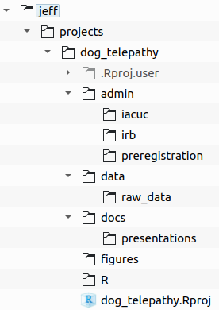

```{r setup, include=FALSE}
library(learnr)
library(gradethis)
knitr::opts_chunk$set(echo = FALSE)
```


## Terminology

Understanding the terminology used when coding in R will help you communicate with other R users and ask better questions when seeking help.

Answer the following questions about this code:

`mydata <- readr::read_csv(file = "data/mydata.csv")`

```{r terminology}
quiz(
  question("Which is the function name?",
           answer("`read_csv`", correct = TRUE),
           answer("`readr`", message = "Words before `::` refer to the package name."),
           answer("`file`", message = "This is the argument name."),
           answer("`data/mydata.csv`", message = "This is the argument value."),
           answer("`mydata`", message = "This is the object that the data are assigned to."),
           allow_retry = TRUE,
           random_answer_order = TRUE
  ),
  question("Which is the argument value?",
           answer("`read_csv`", message = "This is the function value."),
           answer("`readr`", message = "Words before `::` refer to the package name."),
           answer("`file`", message = "This is the argument name."),
           answer("`data/mydata.csv`", correct = TRUE),
           answer("`mydata`", message = "This is the object that the data are assigned to."),
           allow_retry = TRUE,
           random_answer_order = TRUE
  ),
  question("Which is the package name?",
           answer("`read_csv`", message = "This is the function value."),
           answer("`readr`", correct = TRUE),
           answer("`file`", message = "This is the argument name."),
           answer("`data/mydata.csv`", message = "This is the argument value."),
           answer("`mydata`", message = "This is the object that the data are assigned to."),
           allow_retry = TRUE,
           random_answer_order = TRUE
  ),
  question("Which is an object?",
           answer("`read_csv`", message = "This is the function value."),
           answer("`mydata`", correct = TRUE),
           answer("`readr`", message = "Words before `::` refer to the package name."),
           answer("`file`", message = "This is the argument name."),
           answer("`data/mydata.csv`", message = "This is the argument value."),
           allow_retry = TRUE,
           random_answer_order = TRUE
  ),
  question("Which is the argument name?",
           answer("`read_csv`", message = "This is the function value."),
           answer("`readr`", message = "Words before `::` refer to the package name."),
           answer("`file`", correct = TRUE),
           answer("`data/mydata.csv`", message = "This is the argument value."),
           answer("`mydata`", message = "This is the object that the data are assigned to."),
           allow_retry = TRUE,
           random_answer_order = TRUE
  )
)
```


## Running commands

### Console

Running commands from the console is pretty straightforward. You type the command and press `Enter`. Hopefully, all goes well, but sometimes there are problems.

```{r errors-warnings}
question("What is the difference between an error and a warning?",
         answer("Errors stop your code from completing.", correct = TRUE),
         answer("Warnings stop your code from completing."),
         answer("Errors and warnings are the same thing."),
         answer("Warnings are not visible in the console."),
         allow_retry = TRUE,
         random_answer_order = TRUE
)
```

### Scripts

To run commands from scripts, they either have to be transferred to the console, or the entire script must be run.

```{r run-scripts}
quiz(
  question("Which keyboard shortcut transfers the _current line_ in the script to the console to run it?",
           answer("`Ctrl/Cmd+Enter`", correct = TRUE),
           answer("`Ctrl/Cmd+Shift+S`", message = "That shortcut sources the whole script."),
           answer("`Ctrl/Cmd+Alt/Opt+B`", message = "That shortcut runs the code above the cursor."),
           answer("`Enter`", message = "That starts a new line of code."),
           allow_retry = TRUE,
           random_answer_order = TRUE
  ),
  question("Which keyboard shortcut runs the entire script?",
           answer("`Ctrl/Cmd+Shift+S`", correct = TRUE),
           answer("`Ctrl/Cmd+Enter`", message = "That runs only the current line."),
           answer("`Ctrl/Cmd+Alt/Opt+B`", message = "That shortcut runs the code above the cursor."),
           answer("`Enter`", message = "That starts a new line of code."),
           allow_retry = TRUE,
           random_answer_order = TRUE
  ),
  question("What is the term for running a whole script?",
           answer("executing"),
           answer("sourcing", correct = TRUE),
           answer("scripting"),
           answer("R-ing"),
           allow_retry = TRUE,
           random_answer_order = TRUE
  )
)
```


## Assignment

Most of your coding in R will involve assigning values or output from functions to an object.


```{r assignment}
quiz(
  question("Which is the preferred method to assign a value to an object?",
           answer("`x <- 9`", correct = TRUE),
           answer("`x = 9`", message = "This can be confused with argument definition."),
           answer("`x == 9`", message = "This is the syntax for a conditional equals."),
           answer("`9 -> x`", message = "This is backwards."),
           allow_retry = TRUE,
           random_answer_order = TRUE
  ),
  question("Which method is preferred for assigning the same value to multiple objects?",
           answer("`a <- b <- c <- NA`", correct = TRUE),
           answer("`a <- NA, b <- NA, c <- NA`"),
           answer("`a <- NA; b <- NA; c <- NA`"),
           answer("`NA -> c -> b -> a`"),
           allow_retry = TRUE,
           random_answer_order = TRUE
  )
)
```


## Coding style

R is a flexible language with different ways of coding the same thing. While coding *style* is a matter of preference, some techniques can make your code more readable (especially to your instructor!).

```{r coding-style}
question("Which uses the preferred coding style?",
         answer("`sum(mydata, na.rm = TRUE) / 5`", correct = TRUE),
         answer("`sum(mydata,na.rm=TRUE)/5`", message = "This needs more space."),
         answer("`sum(mydata, na.rm = T) / 5`", message = "Avoid abbreviating TRUE."),
         answer("`sum (mydata, na.rm = TRUE) / 5`", message = "Don't put a space after fucntions."),
         allow_retry = TRUE,
         random_answer_order = TRUE
)
```


## Naming things

How you name objects, columns, files, and directories is also a preference, but there are best practices that make these things more human readable, machine readable, searchable, and sortable.

```{r naming}
quiz(
  question("Which is an example of snake case?",
           answer("`my_data`", correct = TRUE),
           answer("`MyData`", message = "This is upper camel case."),
           answer("`myData`", message = "This is camel case."),
           answer("`MY_DATA`", message = "This is screaming snake case."),
           allow_retry = TRUE,
           random_answer_order = TRUE
  ),
  question("Which is a preferred name for an object that contains the t-test results for data from experiment 1?",
           answer("`expt1_ttest`", correct = TRUE),
           answer("`e1t`", message = "Not descriptive enough."),
           answer("`the_ttest_used_on_my_experiment_1_data`", message = "Waaaaaay too descriptive."),
           answer("`ttestforexpt1`", message = "Too cramped. Needs to separate words."),
           answer("`Experiment1TTest`", message = "Avoid upper case."),
           allow_retry = TRUE,
           random_answer_order = TRUE
  ),
    question("Why should you avoid have both `foo.R` and `Foo.R` files in the same directory?",
           answer("Not all operating systems can tell the difference", correct = TRUE),
           answer("They have redundant content"),
           answer("No one should have two foos"),
           answer("What the heck is a foo?"),
           allow_retry = TRUE,
           random_answer_order = TRUE
  ),
    question("Which is in the ISO 8601 standard date format?",
           answer("2021-04-07", correct = TRUE),
           answer("04-07-2021"),
           answer("07-04-2021"),
           answer("07-Apr-2021"),
           answer("Apr. 7, 2021"),
           allow_retry = TRUE,
           random_answer_order = TRUE
  )
)
```


## Directories

### Paths

Here is an absolute path to some data:

`/home/jeff/projects/dog_telepathy/data/raw_data/`

```{r directories}
quiz(
  question("If you are in the `dog_telepathy/` directory, how would you use the command line to get to `raw_data/` using a _relative path_?",
           answer("`cd data/raw_data/`", correct = TRUE),
           answer("`cd /home/jeff/projects/dog_telepathy/data/raw_data/`", message = "This would get you there, but it does not use a relative path."),
           answer("`cd /data/raw_data/`", message = "Starting with `/` creates an absolute path."),
           answer("`cd ../data/raw_data`", message = "Using `..` goes backwards in the path."),
           answer("`cd ../../data/raw_data`", message = "Using `..` goes backwards in the path."),
           allow_retry = TRUE,
           random_answer_order = TRUE
  ),
  question("If you are in the `dog_telepathy/` directory, select TWO ways to use the command line to get to `jeff/`?",
           answer("`cd /home/jeff/`", correct = TRUE),
           answer("`cd ../../`", correct = TRUE),
           answer("`cd ../../..`", message = "You went too far."),
           answer("`cd ../`", message = "Not far enough."),
           answer("`cd home/jeff/`", message = "Without an initial `/`, this is looking for a relative path from this directory."),
           allow_retry = TRUE,
           random_answer_order = TRUE
  )
)
```

### Directory structure

The next question is based on this directory structure.



```{r working-directory}
question("When you open the R Project shown above (`dog_telepathy.Rproj`), what will be the _working directory_ for that project?",
         answer("`jeff/projects/dog_telepathy/`", correct = TRUE),
         answer("`jeff/projects/`", message = "The `.Rproj` file is not in that directory."),
         answer("`jeff/projects/dog_telepathy/.Rproj.user/`", message = "The `.Rproj` file is not in that directory."),
         answer("`jeff/projects/dog_telepathy/dog_telepahty.Rproj`", message = "This is a file rather than a directory."),
         allow_retry = TRUE,
         random_answer_order = TRUE
)
```

### Wrap-up

Way to go---you've completed these exercises!

