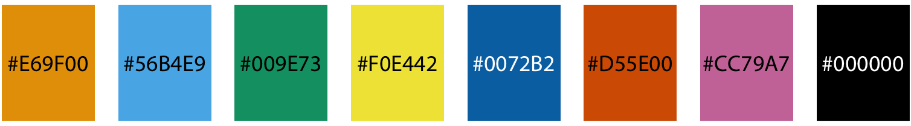

```{r setup, include=FALSE}
library(learnr)
library(tidyverse)
library(palmerpenguins)
gradethis::gradethis_setup()
knitr::opts_chunk$set(echo = FALSE)
penguins <- penguins %>% 
  filter(!is.na(sex)) %>% 
  unite("type", c(species, sex), remove = FALSE) %>% 
  unite("species_island", c(species, island), remove = FALSE)
```


## Introduction

### Set-up

This exercise covers controlling color scales. While the presentation covered a lot of important concepts for using color, this exercise will focus on the code.

Let's load `{tidyverse}` and `{palmerpenguins}`.

```{r echo = TRUE, message = FALSE}
library(tidyverse)
library(palmerpenguins)
```

## Color categories

Probably your most common use of color will be either applying it as a global property or mapping it to categorical/discrete data variables. So thus far in the course, we have used _qualitative_ color space for discrete data.

### ggplot2 default colors

As you have seen, `{ggplot2}` has default colors that it uses for discrete data. You might not have noticed, but the actual colors used depend on the number of categories in the data. For instance, coloring two categories results in a light red and a teal color. But three categories does not use the teal; it uses the light red plus green and blue. Intermediate colors are then introduced as more categories are needed.

```{r ggplot-defaults}
penguins <- penguins %>% 
  filter(!is.na(sex)) %>% 
  unite("type", c(species, sex), remove = FALSE) %>% 
  unite("species_island", c(species, island), remove = FALSE)

penguins %>% 
  ggplot(aes(bill_length_mm, bill_depth_mm, color = sex)) +
  geom_point(size = 3) +
  labs(title = "Two categories")
penguins %>% 
  ggplot(aes(bill_length_mm, bill_depth_mm, color = species)) +
  geom_point(size = 3) +
  labs(title = "Three categories")
penguins %>% 
  ggplot(aes(bill_length_mm, bill_depth_mm, color = species_island)) +
  geom_point(size = 3) +
  labs(title = "Five categories")
penguins %>%
  ggplot(aes(bill_length_mm, bill_depth_mm, color = type)) +
  geom_point(size = 3) +
  labs(title = "Six categories")
```

### Using other palettes

Though the default colors can be nice in some circumstances, you may want to use other colors instead of the defaults. Fortunately, there are other _color palettes_ that people have developed to go together nicely. To use an existing palette, include the `scale_color_brewer()` function and define the palette. Here, we'll use the _Dark2_ palette.

```{r echo = TRUE, color-brewer}
penguins %>% 
  ggplot(aes(bill_length_mm, bill_depth_mm, color = type)) +
  geom_point(size = 3) +
  scale_color_brewer(palette = "Dark2")
```

###

**Change the palette to _Set2_.**

```{r color-brewer2}
penguins %>% 
  ggplot(aes(bill_length_mm, bill_depth_mm, color = type)) +
  geom_point(size = 3) +
  scale_color_brewer(palette = "Set2")
```

```{r exercise1, exercise = TRUE, warning = FALSE}
penguins %>% 
  ggplot(aes(bill_length_mm, bill_depth_mm, color = type)) +
  geom_point(size = 3) +
  ...
```

```{r exercise1-solution}
penguins %>% 
  ggplot(aes(bill_length_mm, bill_depth_mm, color = type)) +
  geom_point(size = 3) +
  scale_color_brewer(palette = "Set2")
```

###

Check out the other palettes by looking in the help documentation for `scale_color_brewer()`.

### Manually setting color

The pre-specified palettes are nice. But sometimes you want to use your own colors. For that, use the `scale_color_manual()` function. Here, I've assigned the colors _firebrick_, _steelblue_, and _seagreen_.

```{r color-manual, echo = TRUE}
penguins %>% 
  ggplot(aes(bill_length_mm, bill_depth_mm, color = species)) +
  geom_point(size = 3) +
  scale_color_manual(values = c("firebrick", "steelblue", "seagreen"))
```

###

A list of color names used in R is available with `colors()`, and a document that illustrates the colors is available at http://www.stat.columbia.edu/~tzheng/files/Rcolor.pdf.

However, that is only 627 colors. R can also read in color hex codes that specify values of red, green, and blue to generate 16 million colors. There are many websites that can help you [generate hex codes for colors](https://www.w3schools.com/colors/colors_hexadecimal.asp). Hex codes start with `#` then specify RGB with six hexidecimal digits. You can use these seven-character strings to specify colors in R just like you can use the color names.

**Set the colors for the previous plot to be `#cd025c`, `#2e84d5`, and `#95c551`.**

```{r color-manual2}
penguins %>% 
  ggplot(aes(bill_length_mm, bill_depth_mm, color = species)) +
  geom_point(size = 3) +
  scale_color_manual(values = c("#cd025c", "#2e84d5", "#95c551"))
```

```{r exercise2, exercise = TRUE, warning = FALSE}
penguins %>% 
  ggplot(aes(bill_length_mm, bill_depth_mm, color = type)) +
  geom_point(size = 3) +
  ...
```

```{r exercise2-solution}
penguins %>% 
  ggplot(aes(bill_length_mm, bill_depth_mm, color = species)) +
  geom_point(size = 3) +
  scale_color_manual(values = c("#cd025c", "#2e84d5", "#95c551"))
```

###

If you're going to use the same customized colors repeatedly, it makes sense to create a vector of those colors, then just refer to the vector when you plot.

**Define this color palette, then use the first, fourth, and seventh color to represent species. Don't copy the hex codes into the plot---use the vector and index the appropriate elements.**

```{r color-pallette, echo = TRUE}
my_palette <- c("#2B547E", "#E0FFFF", "#46C7C7", "#4CC552", "#FDD017", "#C35817", "#E41B17", "#C48189", "#C45AEC")
```

```{r color-manual3}
penguins %>% 
  ggplot(aes(bill_length_mm, bill_depth_mm, color = species)) +
  geom_point(size = 3) +
  scale_color_manual(values = my_palette[c(1, 4, 7)])
```

```{r exercise3, exercise = TRUE, warning = FALSE}
my_palette <- c("#2B547E", "#E0FFFF", "#46C7C7", "#4CC552", "#FDD017", "#C35817", "#E41B17", "#C48189", "#C45AEC")
penguins %>% 
  ggplot(aes(bill_length_mm, bill_depth_mm, color = type)) +
  geom_point(size = 3) +
  ...
```

```{r exercise3-solution}
my_palette <- c("#2B547E", "#E0FFFF", "#46C7C7", "#4CC552", "#FDD017", "#C35817", "#E41B17", "#C48189", "#C45AEC")
penguins %>% 
  ggplot(aes(bill_length_mm, bill_depth_mm, color = species)) +
  geom_point(size = 3) +
  scale_color_manual(values = my_palette[c(1, 4, 7)])
```

### Fill

We've focused on the `color` argument for points. The same principles apply to fill colors as well, except you need to use the `scale_fill_manual()` or `scale_fill_brewer()` functions.

**Plot the counts of each species and fill the bars based on species using _firebrick_, _steelblue_, and _seagreen_.**

```{r color-fill}
penguins %>% 
  ggplot(aes(x = species, fill = species)) +
  geom_bar() +
  scale_fill_manual(values = c("firebrick", "steelblue", "seagreen"))
```

```{r exercise4, exercise = TRUE, warning = FALSE}
penguins %>% 
  ggplot(aes(x = species, fill = species)) +
  geom_bar() +
  ...
```

```{r exercise4-solution}
penguins %>% 
  ggplot(aes(x = species, fill = species)) +
  geom_bar() +
  scale_fill_manual(values = c("firebrick", "steelblue", "seagreen"))
```

###

**Now make a violin plot of bill length for each species with the violin area and border colored  _firebrick_, _steelblue_, and _seagreen_ based on species. Make the violin area transparency 0.25.**

```{r color-fill2}
penguins %>% 
  ggplot(aes(x = species, y = bill_length_mm, fill = species, color = species)) +
  geom_violin(alpha = 0.25) +
  scale_fill_manual(values = c("firebrick", "steelblue", "seagreen")) +
  scale_color_manual(values = c("firebrick", "steelblue", "seagreen"))
```

```{r exercise5, exercise = TRUE, warning = FALSE}
penguins %>% 
  ggplot(aes(x = species, y = bill_length_mm, fill = species, color = species)) +
  geom_violin(...) +
  ...
```

```{r exercise5-hint-1}
# If you're mapping both color and fill, how many `scale_` functions do you need?
```

```{r exercise5-solution}
penguins %>% 
  ggplot(aes(x = species, y = bill_length_mm, fill = species, color = species)) +
  geom_violin(alpha = 0.25) +
  scale_fill_manual(values = c("firebrick", "steelblue", "seagreen")) +
  scale_color_manual(values = c("firebrick", "steelblue", "seagreen"))
```

### Color vision deficiency-safe colors

Unfortunately, the default colors in `{ggplot2}` can be difficult to distinguish for people with color vision deficiency (CVD). And choosing your own palette could also result in these ambiguities. There are two options to avoid colors that cause confusion. First, you can develop your own palette and then run it through a CVD simulator such as [Color Oracle](https://colororacle.org/). Alternatively, you can use the [Okabe-Ito palette](https://jfly.uni-koeln.de/color) specifically designed to minimize ambiguity for people with different forms of CVD. 

```{r}

```

There are two ways to implement the Okabe-Ito palette. You can either install a package that has it included (e.g., use the `scale_color_colorblind()` function in [`{ggthemes}`](https://jrnold.github.io/ggthemes)), or simply assign the hex codes to an object in your script (this is what I do). 


**Manually assign the Okabe-Ito palette to this plot using the `cvd_safe` vector created below.**

```{r cvd-safe}
cvd_safe <- c("#E69F00", "#56B4E9", "#009E73", "#F0E442", "#0072B2", "#D55E00", "#CC79A7")
penguins %>% 
  ggplot(aes(bill_length_mm, bill_depth_mm, color = type)) +
  geom_point(size = 3) +
  scale_color_manual(values = cvd_safe)
```

```{r exercise9, exercise = TRUE, warning = FALSE}
cvd_safe <- c("#E69F00", "#56B4E9", "#009E73", "#F0E442", "#0072B2", "#D55E00", "#CC79A7")
penguins %>% 
  ggplot(aes(bill_length_mm, bill_depth_mm, color = type)) +
  geom_point(size = 3) +
  ...
```

```{r exercise9-solution}
cvd_safe <- c("#E69F00", "#56B4E9", "#009E73", "#F0E442", "#0072B2", "#D55E00", "#CC79A7")
penguins %>% 
  ggplot(aes(bill_length_mm, bill_depth_mm, color = type)) +
  geom_point(size = 3) +
  scale_color_manual(values = cvd_safe)
```

## Color gradients

While we will often use qualitative color scales for discrete data, sometimes we will want to add color based on continuous data. This is a _color gradient_. Continuous data can either be ordered in a single direction (sequential color gradient) or they can be ordered in two directions away from a central value (diverging color gradient).

### Sequential color gradients

Sequential color gradients will likely be the most common gradient you will use. These gradients typically start with a "low" color value and transition through the color spectrum to a "high" value. By default, `{ggplot2}` starts with dark blue and transitions to a light blue. 

Here, we'll plot bill length by height but color the individual penguins based on their body mass.

```{r color-gradient, echo = TRUE}
penguins %>% 
  ggplot(aes(bill_length_mm, bill_depth_mm, color = body_mass_g)) +
  geom_point(size = 4)
```

###

To control the colors used for the gradient, use the `scale_color/fill_gradient()` function, and set the `low` and `high` argument to color names or hex codes.

**Replicate the previous plot, but have the color gradient from _white_ to _firebrick_.**
```{r color-gradient2}
penguins %>% 
  ggplot(aes(bill_length_mm, bill_depth_mm, color = body_mass_g)) +
  geom_point(size = 4) +
  scale_color_gradient(low = "white", high = "firebrick")
```

```{r exercise6, exercise = TRUE, warning = FALSE}
penguins %>% 
  ggplot(...) +
  ...
```

```{r exercise6-solution}
penguins %>% 
  ggplot(aes(bill_length_mm, bill_depth_mm, color = body_mass_g)) +
  geom_point(size = 4) +
  scale_color_gradient(low = "white", high = "firebrick")
```

### Viridis gradients

Many standard gradients like rainbow or white to another color can be confusing, may not translate well to grey scale, or may cause difficulties for people with color vision deficiency. The *viridis* gradients were developed to reduce these concerns and provide robust sequential gradients. We'll use the `scale_color_viridis_c()` function to add these gradients (note the `scale_color_viridis_d()` function for discrete/categorical data and the `scale_color_viridis_b()` function is for binned continuous data).

```{r color-gradient-viridis, echo = TRUE}
penguins %>% 
  ggplot(aes(bill_length_mm, bill_depth_mm, color = body_mass_g)) +
  geom_point(size = 4) +
  scale_color_viridis_c()
```

###

There are six different vidiris palettes. You can use them with the `option` argument with values `A`-`F`.

**Set the vidiris option to B to create this plot.**

```{r color-gradient-viridis2}
penguins %>% 
  ggplot(aes(bill_length_mm, bill_depth_mm, color = body_mass_g)) +
  geom_point(size = 4) +
  scale_color_viridis_c(option = "B")
```

```{r exercise7, exercise = TRUE, warning = FALSE}
penguins %>% 
  ggplot(...) +
  ...
```

```{r exercise7-solution}
penguins %>% 
  ggplot(aes(bill_length_mm, bill_depth_mm, color = body_mass_g)) +
  geom_point(size = 4) +
  scale_color_viridis_c(option = "B")
```

### Diverging color gradients

In addition to sequential gradients, you may want to illustrate diverging gradients. Diverging gradients are used for continuous data with gradients moving away from a central value. For example, political ideology may move away from moderate in conservative and liberal directions. Also, some ratings scales may have a central reference point of "neutral" and move towards agreement and disagreement. Finally, difference scores and correlations move in positive and negative directions from a reference point of 0.

We don't have any data like this in the penguins dataset, so we'll create some by scaling/centering the body mass data.

```{r echo=TRUE}
penguins %>% 
  mutate(mass_z = scale(body_mass_g), .before = bill_length_mm)
```

Now we can use the `scale_color_distiller()` function (like the `scale_color_brewer()` function but for continuous, diverging data) to add a diverging color scale.

**Add a diverging scale for the `mass_z` variable using the _RdBu_ palette.**

```{r color-diverging}
penguins %>% 
  mutate(mass_z = scale(body_mass_g)) %>% 
  ggplot(aes(bill_length_mm, bill_depth_mm, color = mass_z)) +
  geom_point(size = 4) +
  scale_color_distiller(palette = "RdBu")
```

```{r exercise8, exercise = TRUE, warning = FALSE}
penguins %>% 
  mutate(mass_z = scale(body_mass_g)) %>% 
  ggplot(...) +
  ...
```

```{r exercise8-solution}
penguins %>% 
  mutate(mass_z = scale(body_mass_g)) %>% 
  ggplot(aes(bill_length_mm, bill_depth_mm, color = mass_z)) +
  geom_point(size = 4) +
  scale_color_distiller(palette = "RdBu")
```


###

This is not great and shows the disadvantages of using scales that include white or light grey. Try out the _RdYlBu_ and _Spectral_ palettes to see if they're any better.

### Wrap-up

You can now have complete control over the color of your plots---way to go!

