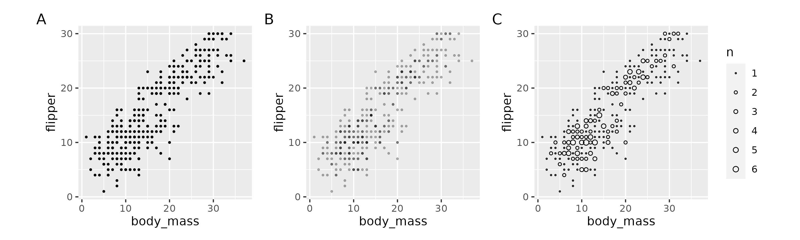

```{r setup, include=FALSE}
library(learnr)
library(tidyverse)
library(palmerpenguins)
library(ggbeeswarm)
library(patchwork)
library(Hmisc)
gradethis::gradethis_setup()
knitr::opts_chunk$set(echo = FALSE)

bill_flipper_plot <- penguins %>% 
  ggplot(aes(x = bill_length_mm, y = flipper_length_mm, color = species)) +
  geom_point(show.legend = FALSE)

bill_body_plot <- penguins %>% 
  ggplot(aes(x = bill_length_mm, y = body_mass_g, color = species)) +
  geom_point(show.legend = FALSE)

flipper_body_plot <- penguins %>% 
  ggplot(aes(x = flipper_length_mm, y = body_mass_g, color = species)) +
  geom_point(show.legend = FALSE)
```


## Introduction

This exercise covers finessing your plots by working with overlapping data, redundant coding, scaling axes, and multiple plots.

### Set-up

Load `{tidyverse}` and `{palmerpenguins}`. We're also going to use the `{ggbeeswarm}` package.

```{r echo = TRUE, message = FALSE}
library(tidyverse)
library(palmerpenguins)
library(ggbeeswarm)

```

## Overlapping data

### 
Often multiple data points can occupy the same location in x and y space on a Cartesian coordinate system. These overlapping points can be deceiving because they do not show us the true distribution of the data (A). We have already discussed two ways to deal with overlapping data: altering point transparency (B) and scaling point size to the number of observations (C).

```{r overplotting, warning=FALSE, include=FALSE}
overplot1 <- penguins %>% 
  mutate(body_mass = cut_width(body_mass_g, 100, labels = FALSE),
         flipper = cut_width(flipper_length_mm, 2, labels = FALSE)) %>% 
  ggplot(aes(x = body_mass, y = flipper)) +
  geom_point(size = 0.5) +
  theme(aspect.ratio = 1)

overplot2 <- penguins %>% 
  mutate(body_mass = cut_width(body_mass_g, 100, labels = FALSE),
         flipper = cut_width(flipper_length_mm, 2, labels = FALSE)) %>% 
  ggplot(aes(x = body_mass, y = flipper)) +
  geom_point(alpha = 0.25, size = 0.5) +
  theme(aspect.ratio = 1)


overplot3 <- penguins %>% 
  mutate(body_mass = cut_width(body_mass_g, 100, labels = FALSE),
         flipper = cut_width(flipper_length_mm, 2, labels = FALSE)) %>% 
  ggplot(aes(x = body_mass, y = flipper)) +
  geom_count(shape = 21) +
  scale_size(range = c(0.25, 2)) +
  theme(aspect.ratio = 1)

overplot1 + overplot2 + overplot3 + plot_annotation(tag_levels = "A")
ggsave("images/overlapping.png", width = 10, height = 3)
```

{ width=100% }

###

Overlapping points are especially troublesome for data that have a categorical variables. For example, there is massive overlap in the following plot, although it might not be that obvious.

```{r species-flipper, warning=FALSE}
penguins %>% 
  ggplot(aes(x = species, y = flipper_length_mm)) +
  geom_point()
```

### Jittering 

One way to avoid overlapping data is to _jitter_ or add a bit of noise to the data. This can be done with the `geom_jitter()` function or by setting `position = "jitter"`.

```{r jitter, echo=TRUE, warning=FALSE}
penguins %>% 
  ggplot(aes(x = species, y = flipper_length_mm)) +
  geom_jitter()
```

###

By default, a good bit of jitter is added. You can control the amount of jitter with the `width` argument.

**Set the `width` argument to 0.05. Note your graph may look slightly different from this one since jitter involves random noise.**

```{r jitter-width, warning=FALSE}
penguins %>% 
  ggplot(aes(x = species, y = flipper_length_mm)) +
  geom_jitter(width = 0.05)
```

```{r exercise1, exercise = TRUE, warning = FALSE, message = FALSE}
penguins %>% 
  ...
```

```{r exercise1-solution}
penguins %>% 
  ggplot(aes(x = species, y = flipper_length_mm)) +
  geom_jitter(width = 0.05)
```

### Beeswarm plots

An alternative to adding noise is to spread out overlapping points in a line. This is called a _beeswarm_ plot. Of course, this works best when you have a categorical variable with relatively few levels. It would not work well in the flipper/body mass plots at the top of this page.

```{r beeswarm, echo = TRUE, warning=FALSE}
penguins %>% 
  ggplot(aes(x = species, y = flipper_length_mm)) +
  geom_beeswarm()
```

###

Beeswarm plots are a good way to show data behind for example means and error.

**Replicate this beeswarm plot with _grey70_ points and add the species means and 95% confidence intervals.**

```{r beeswarm-means, warning=FALSE}
penguins %>% 
  ggplot(aes(x = species, y = flipper_length_mm)) +
  geom_beeswarm(color = "grey70") +
  stat_summary(fun.data = mean_cl_normal)
```

```{r exercise2, exercise = TRUE, warning = FALSE, message = FALSE}
penguins %>% 
  ...
```

```{r exercise2-solution}
penguins %>% 
  ggplot(aes(x = species, y = flipper_length_mm)) +
  geom_beeswarm(color = "grey70") +
  stat_summary(fun.data = mean_cl_normal)
```


## Redundant coding

###

A good practice when plotting data is to redundantly code groups with multiple object properties. For example, people with color vision deficiency may not easily discern color differences, so varying shape (for points) or line type (for lines) can help readers discriminate the groups.

First, we'll start with an interaction plot that shows flipper length as a function of year, with separate lines for species. This example includes both lines and points, which offers several opportunities for redundant coding.

```{r year-flipper, echo=TRUE, warning=FALSE}
penguins %>% 
  ggplot(aes(x = factor(year), y = flipper_length_mm, group = species)) +
  stat_summary(fun = mean) +
  stat_summary(fun = mean, geom = "line")
```

###

**Map color, point shape, and line type to species.**

```{r interaction, warning=FALSE}
penguins %>% 
  ggplot(aes(x = factor(year), y = flipper_length_mm, group = species, color = species, shape = species, linetype = species)) +
  stat_summary(fun = mean) +
  stat_summary(fun = mean, geom = "line")
```

```{r exercise3, exercise = TRUE, warning = FALSE, message = FALSE}
penguins %>% 
  ...
```

```{r exercise3-solution}
penguins %>% 
  ggplot(aes(x = factor(year), y = flipper_length_mm, group = species, color = species, shape = species, linetype = species)) +
  stat_summary(fun = mean) +
  stat_summary(fun = mean, geom = "line")
```

###

Notice that color, point shape, and line type are also all shown in the legend. This is a fairly simple plot, but plots where the lines cross can make it difficult to track the groups, so redundant coding is especially useful then.

Here is an example of a plot of mine that uses redundant coding but also codes factorially with skew level coded by color and shape and skipping/guessing coded by line type.

{ width=100% }

## Scaling axes

###

You may want to scale axes to either zoom in or out. Both directions use the same syntax, and there are two ways to scale axes. 

The plot below shows all of the data, but say we only want to show the data from penguins with flipper lengths between 200-220 mm and body masses between 4000-5000 g (illustrated in blue rectangle).

```{r mass-flipper, warning=FALSE, message=FALSE}
penguins %>% 
  ggplot(aes(x = body_mass_g, y = flipper_length_mm)) +
  annotate("rect", xmin = 4000, xmax = 5000, ymin = 200, ymax = 220, fill = "blue", alpha = 0.2) +
  geom_point() +
  geom_smooth()
```

### Scaling limits


The first way to do this is to scale the axis limits. This has the effect of setting all data outside of the limits to NA. While this isn't a problem for plotting raw data like points, removing data affects statistical transformations such as curve fits, boxplots, counts, etc.

There are three ways to scale axis limits: `scale_x/y_continuous/discrete()`, `lims()`, and `xlim/ylim()`. Since want to scale both axes, we'll use `lims()`, which let's us scale both axes in one line.

**Add the following line to the previous plot: `lims(x = c(4000, 5000), y = c(200, 220))`.**

```{r scale-limits, warning=FALSE, message=FALSE}
penguins %>% 
  ggplot(aes(x = body_mass_g, y = flipper_length_mm)) +
  geom_point() +
  geom_smooth() +
  lims(x = c(4000, 5000), y = c(200, 220))
```

```{r exercise4, exercise = TRUE, warning = FALSE, message = FALSE}
penguins %>% 
  ggplot(aes(x = body_mass_g, y = flipper_length_mm)) +
  geom_point() +
  geom_smooth() +
  ...
```

```{r exercise4-solution}
penguins %>% 
  ggplot(aes(x = body_mass_g, y = flipper_length_mm)) +
  geom_point() +
  geom_smooth() +
  lims(x = c(4000, 5000), y = c(200, 220))
```

###

Notice how the curve looks different than it does in the original plot in this range. That is because, in this plot, the curve is calculated based on only the data points shown in the current plot. The curve in the original plot was calculated based on all of the data.


### Scaling coordinates

The other way to scale your plot is to scale the coordinates directly. This has the effect of zooming in and out without altering the data or resultant statistical transformations. You can scale the coordinates with the `coord_cartesian()` function.


```{r scale-coord, echo=TRUE, warning=FALSE, message=FALSE}
penguins %>% 
  ggplot(aes(x = body_mass_g, y = flipper_length_mm)) +
  geom_point() +
  geom_smooth() +
  coord_cartesian(xlim = c(4000, 5000), ylim = c(200, 220), expand = FALSE)
```

###

Note two differences from the previous plot. First, the data outside of the limits are still visible in the slight buffer beyond the limits (to remove this buffer, set `expand = FALSE` in `coord_cartesian()`). This hints at the second difference, which is that these and all other data that are outside of these limits are still being passed to the statistical transformations; in this case, the `geom_smooth()` curve.

```{r scale-comparison, warning=FALSE, message=FALSE}
scale_axis <- penguins %>% 
  ggplot(aes(x = body_mass_g, y = flipper_length_mm)) +
  geom_point() +
  geom_smooth() +
  lims(x = c(4000, 5000), y = c(200, 220)) +
  labs(title = "Scale axes", subtitle = "with lims()")

scale_coord <- penguins %>% 
  ggplot(aes(x = body_mass_g, y = flipper_length_mm)) +
  geom_point() +
  geom_smooth() +
  coord_cartesian(xlim = c(4000, 5000), ylim = c(200, 220)) +
  labs(title = "Scale coordinates", subtitle = "with coord_cartesian()")

scale_axis + scale_coord
```

So if you have any statistical transformations in your plots, you'll probably want to use the `coord_cartesian()` method to scale your plots. But if you're just plotting raw data (points) and don't want to show any points on the periphery of your limits, then you can scale the axes with `scale_x/y_continuous`, `x/ylim()`, or `lims()`.


## Multiple plots


### Faceting

When plots have too many factors included in them, they can get too busy. _Faceting_ allows you to separate out factor levels into different panels and is a powerful techique to improve your visualizations.

For example, here we illustrate the species factor by using different colors to represent the three species of penguins.

```{r mass-flipper2, warning=FALSE}
penguins %>% 
  ggplot(aes(x = body_mass_g, y = flipper_length_mm, color = species)) +
  geom_point() 
```

###

While this is fine for this case, there maybe reasons to pull the species out into separate facets. For the case of a single factor, it is best to use the `facet_wrap()` function.

```{r facet-wrap, echo=TRUE, warning=FALSE}
penguins %>% 
  ggplot(aes(x = body_mass_g, y = flipper_length_mm)) +
  geom_point() +
  facet_wrap(~ species)
```

###

Faceting creates a panel for each level of the factor and adds a label in a rectangle up top called a _strip_. We'll see how to customize the strip when we work with themes. Notice that, like axes, the facet labels are drawn from the data.

Also notice how the axes scales are the same in all three panels. The default behavior is to use the full range of all data in all panels. However, you can allow the panels to scale independently by passing the `scales` argument to the `facet_wrap()`.

**Add `scales = "free"` to the previous plot.**

```{r facet-scale-free, warning=FALSE}
penguins %>% 
  ggplot(aes(x = body_mass_g, y = flipper_length_mm, color = species)) +
  geom_point() +
  facet_wrap(~ species, scales = "free")
```

```{r exercise5, exercise = TRUE, warning = FALSE, message = FALSE}
penguins %>% 
  ggplot(aes(x = body_mass_g, y = flipper_length_mm, color = species)) +
  geom_point() +
  facet_wrap(...)
```

```{r exercise5-solution}
penguins %>% 
  ggplot(aes(x = body_mass_g, y = flipper_length_mm, color = species)) +
  geom_point() +
  facet_wrap(~ species, scales = "free")
```

### 

Now each panel is scaled independently for both axes. If you want to freely scale only one of the axes, use `"free_x"` or `"free_y"`.

###

If you add a second factor to `facet_wrap()`, it will include separate panels for the factorial combinations of levels. Add additional factors by separating them with `*`: `facet_wrap(~ var1 * var2)`.

**Facet by both species and island.**

```{r facet-wrap2, warning=FALSE}
penguins %>% 
  ggplot(aes(x = body_mass_g, y = flipper_length_mm, color = species)) +
  geom_point()  +
  facet_wrap(~ species * island)
```

```{r exercise6, exercise = TRUE, warning = FALSE, message = FALSE}
penguins %>% 
  ggplot(aes(x = body_mass_g, y = flipper_length_mm, color = species)) +
  geom_point() +
  facet_wrap(...)
```

```{r exercise6-solution}
penguins %>% 
  ggplot(aes(x = body_mass_g, y = flipper_length_mm, color = species)) +
  geom_point() +
  facet_wrap(~ species * island)
```


###

When you pass multiple variables to the `facet_wrap()` function, it just plots them in a single row and then wraps them onto a new row if there are more panels than will fit on a single row. Notice that it also drops factorial combinations that have no data.

While you can use `facet_wrap()` for multiple variables, the `facet_grid()` function does a better job with two variables because it assigns one variable as rows and one as columns (i.e., builds a grid). Notice that it does not drop factorial combinations that have no data.

```{r facet-grid, echo=TRUE, warning=FALSE}
penguins %>% 
  ggplot(aes(x = body_mass_g, y = flipper_length_mm, color = species)) +
  geom_point()  +
  facet_grid(island ~ species)
```


### Compound plots

Facets are used when you want to separate the same data set and same x/y axis variables by other categorical variables. But sometimes you have plots from completely different sets of variables or data frames that you want to combine into a single figure (e.g., subfigures). These _compound plots_ can be created using other packages. While the [`{cowplot}`](https://wilkelab.org/cowplot/) package from Claus Wilke gives a lot of control over compound plots, we'll focus on the  [`{patchwork}`](https://patchwork.data-imaginist.com/) package because it is very easy to use.

To use `{patchwork}` simply assign your plots to objects and connect them with `+`.

```{r compound, echo=TRUE, warning=FALSE}
bill_flipper_plot <- penguins %>% 
  ggplot(aes(x = bill_length_mm, y = flipper_length_mm, color = species)) +
  geom_point(show.legend = FALSE)

bill_body_plot <- penguins %>% 
  ggplot(aes(x = bill_length_mm, y = body_mass_g, color = species)) +
  geom_point(show.legend = FALSE)

flipper_body_plot <- penguins %>% 
  ggplot(aes(x = flipper_length_mm, y = body_mass_g, color = species)) +
  geom_point(show.legend = FALSE)

bill_flipper_plot + bill_body_plot + flipper_body_plot
```

###

To stack the plots vertically instead of horizontally, use `plot_layout()` (connected with a `+` after the last plot) and set the number of rows with the `nrow` argument (e.g., `plot1 + plot2 + plot_layout(nrow = 2)`).

**Stack the `bill_flipper_plot`, `bill_body_plot`, and `flipper_body_plot` plots vertically.**

```{r compound2, warning = FALSE}
bill_flipper_plot + bill_body_plot + flipper_body_plot + plot_layout(nrow = 3)
```

```{r exercise7, exercise = TRUE, warning = FALSE, message = FALSE}
...
```

```{r exercise7-solution}
bill_flipper_plot + bill_body_plot + flipper_body_plot + plot_layout(nrow = 3)
```

###

The dimensions of the plots changed depending whether they were plotted vertically or horizontally. We'll see how to work with aspect ratios when we cover plot themes.

###

With subfigures, you often want to label or 'tag' them. To do this, you need to add the `plot_annotation()` function with arguments for `tag_levels()` (`"a"` for lowercase letters, `"A"` for uppercase letters, `"1"` for numbers,, `"i"` for lowercase Roman numerals, and `"I"` for uppercase Roman numerals). You can also add prefixes and suffixes (e.g., `.` or `(` and `)`).

```{r compound3, echo = TRUE, warning = FALSE}
bill_flipper_plot + bill_body_plot + flipper_body_plot + plot_layout(nrow = 3) + plot_annotation(tag_levels = "a", tag_suffix = ".")
```

### Wrap-up

You are now a certified distribution visualization expert!

